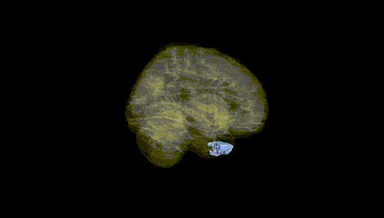
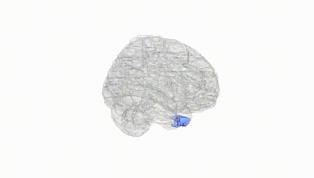
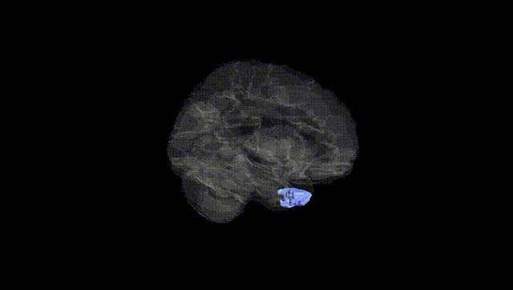
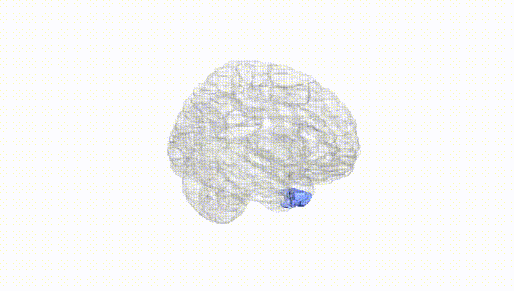
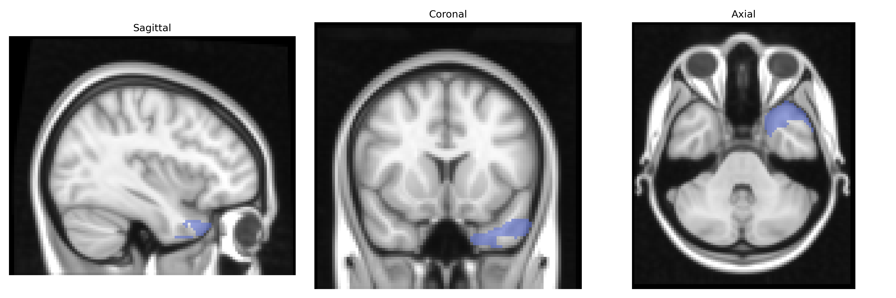
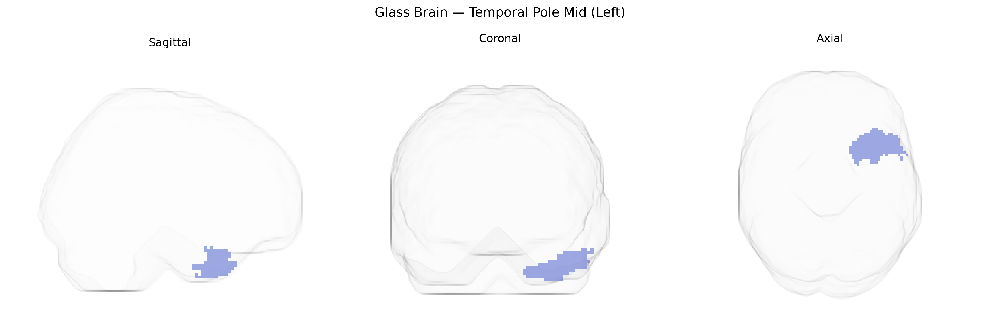

# Temporal Pole Mid (Left)
 
## Overview
 
The left Temporal Pole Mid (Left) region in the AAL atlas corresponds to the anterior portion of the middle temporal gyrus at the temporal pole, forming part of the anterior temporal lobe involved in high-level multimodal integration. This area participates in semantic memory, conceptual knowledge, and the processing of socially relevant information, including aspects of social cognition and emotional appraisal of complex stimuli. It receives convergent input from auditory, visual, and limbic structures and is interconnected with orbitofrontal cortex, amygdala, and other temporal association areas, supporting roles in language comprehension (particularly semantic and narrative processing), person knowledge, and affective processing. Although there is no direct Wikipedia article for “Temporal Pole Mid” as defined in the AAL atlas, this region lies within the [Temporal pole](https://en.wikipedia.org/wiki/Temporal_pole).
 
The left temporal pole (mid, AAL “Temporal_Pole_Mid_L”) has been implicated in genetic studies primarily through its roles in semantic memory, social-emotional processing, and language, with imaging-genetics and GWAS work linking variation in this region’s structure and function to multiple neuropsychiatric and neurodegenerative conditions. Twin and SNP-based heritability studies indicate moderate to high heritability of temporal pole cortical thickness and surface area, with notable contributions from common variants in pathways related to neurodevelopment, synaptic function, and axon guidance. Large brain-structure GWAS consortia (e.g., ENIGMA) have identified associations between temporal pole morphology and variants near genes such as HMGA2 (broad brain and head-size effects), DRAM1 and MAPT-region loci (frontotemporal and temporal lobe vulnerability), and other loci involved in neuronal growth and plasticity. Disorder-focused GWAS and imaging-genetics analyses have linked temporal pole alterations to schizophrenia, major depressive disorder, bipolar disorder, and autism spectrum conditions, often finding that polygenic risk scores for these disorders correlate with reduced temporal pole volume or altered connectivity. The region is also a site of early atrophy in semantic variant primary progressive aphasia and some forms of frontotemporal dementia, where risk variants in genes such as GRN, C9orf72, and MAPT contribute to vulnerability of anterior temporal structures, including the left temporal pole.
 
*Overview generated by GPT-4o (2026).*
 
---
 
**Region ID:** 8211  
**Hemisphere:** left  
**Atlas:** AAL 
 
---
 
## Temporal Pole Mid (Left) – Black Background (Full Brain)
 

 
**Full Quality Version:** <a href="full_black.mp4" download>Download MP4</a>
 
---
 
## Temporal Pole Mid (Left) – White Background (Full Brain)
 

 
**Full Quality Version:** <a href="full_white.mp4" download>Download MP4</a>
 
---

## Temporal Pole Mid (Left) – Black Background (Hemisphere)
 

 
**Full Quality Version:** <a href="hemi_black.mp4" download>Download MP4</a>
 
---
 
## Temporal Pole Mid (Left) – White Background (Hemisphere)
 

 
**Full Quality Version:** <a href="hemi_white.mp4" download>Download MP4</a>
 
---

## Triplanar View – T1 Background
 

 
---
 
## Triplanar View – Ghost Brain
 


