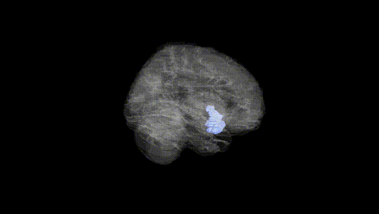
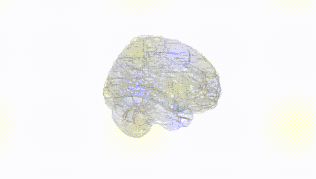
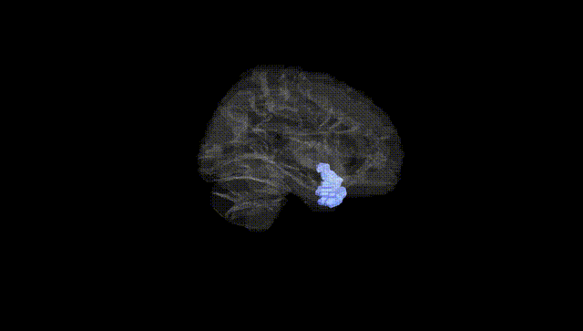
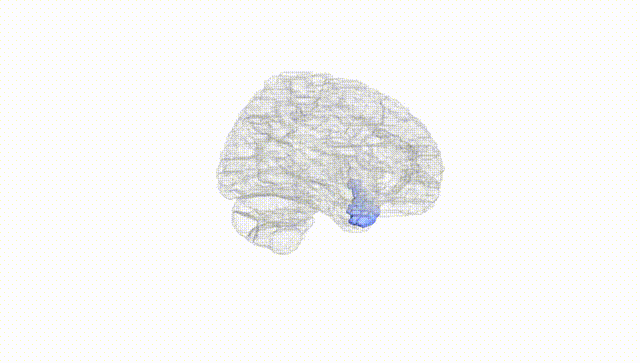
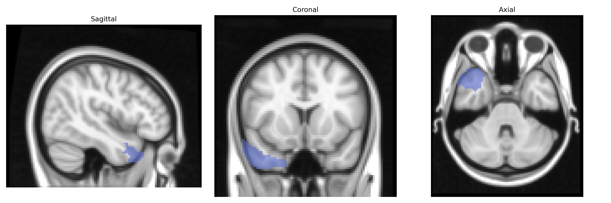
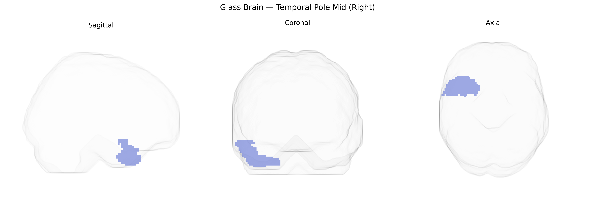

# Temporal Pole Mid (Right)
 
## Overview
 
The right Temporal Pole Mid (Right) region in the AAL atlas corresponds approximately to the anterior portion of the middle temporal gyrus at the temporal pole, forming part of the anterior temporal lobe association cortex. This area is involved in high-level semantic processing, social and emotional cognition, autobiographical memory, and the integration of multimodal sensory information, and is closely connected with limbic and paralimbic structures such as the amygdala and orbitofrontal cortex. Cytoarchitectonically, it belongs to higher-order association cortex and participates in the anterior temporal network implicated in semantic memory and social knowledge. There is no direct Wikipedia article for “Temporal Pole Mid”; a closely related structure is the temporal pole: [Temporal pole](https://en.wikipedia.org/wiki/Temporal_pole).
 
The right temporal pole (AAL “Temporal_Pole_Mid_R”) is a key node in socio-emotional processing and semantic memory, and while GWAS rarely target it in isolation, imaging-genetics studies indicate that its structure and function are moderately heritable and influenced by common variants. Large neuroimaging GWAS (e.g., ENIGMA, UK Biobank) have identified associations between temporal pole cortical thickness or volume and variants in or near genes involved in neurodevelopment and synaptic function, such as KIAA0586, WNT3, and genes in glutamatergic and GABAergic pathways, though these signals are typically shared across temporal and limbic regions rather than exclusive to the right pole. The region has been implicated in genetic risk for neuropsychiatric disorders that show temporal pole abnormalities, including schizophrenia, bipolar disorder, major depression, autism spectrum disorder, and frontotemporal dementia, with polygenic risk scores for these conditions correlating with temporal pole morphology or connectivity in some cohorts. Alzheimer’s disease–related GWAS loci (e.g., APOE, BIN1, CLU) and genes linked to tau pathology are relevant because the anterior temporal lobe and temporal pole are early sites of neurodegeneration and atrophy, and carriers of high-risk variants often exhibit altered temporal pole structure or metabolism. Genetic variants interacting with language and social cognition traits—such as FOXP2-related networks and common loci associated with empathy, theory of mind, and face processing—have also been associated with functional activation and connectivity patterns encompassing the right temporal pole, underscoring its role as a genetically influenced hub in social-emotional and semantic networks.
 
*Overview generated by GPT-4o (2026).*
 
---
 
**Region ID:** 8212  
**Hemisphere:** right  
**Atlas:** AAL 
 
---
 
## Temporal Pole Mid (Right) – Black Background (Full Brain)
 

 
**Full Quality Version:** <a href="full_black.mp4" download>Download MP4</a>
 
---
 
## Temporal Pole Mid (Right) – White Background (Full Brain)
 

 
**Full Quality Version:** <a href="full_white.mp4" download>Download MP4</a>
 
---

## Temporal Pole Mid (Right) – Black Background (Hemisphere)
 

 
**Full Quality Version:** <a href="hemi_black.mp4" download>Download MP4</a>
 
---
 
## Temporal Pole Mid (Right) – White Background (Hemisphere)
 

 
**Full Quality Version:** <a href="hemi_white.mp4" download>Download MP4</a>
 
---

## Triplanar View – T1 Background
 

 
---
 
## Triplanar View – Ghost Brain
 


