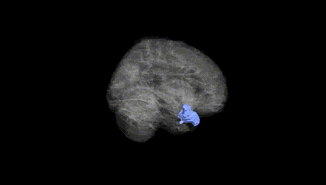
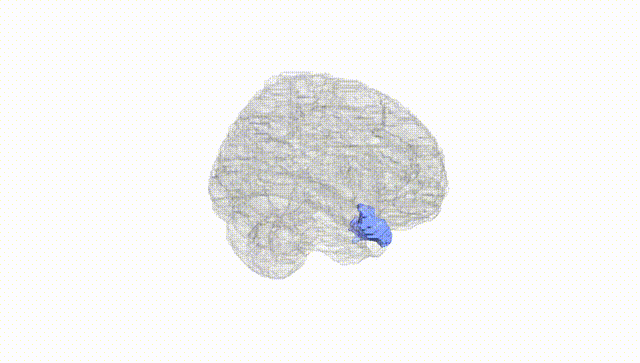
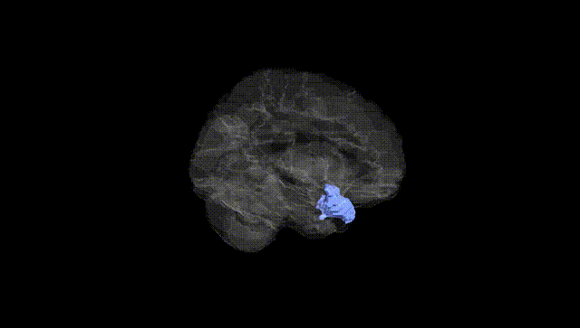
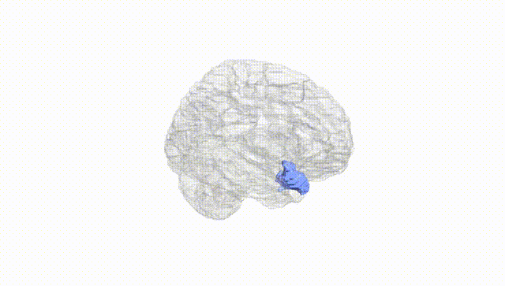
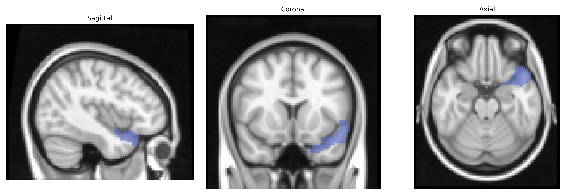
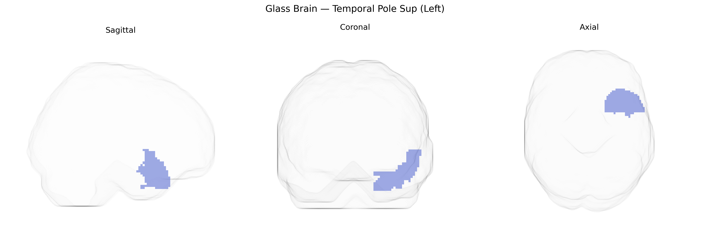

# Temporal Pole Sup (Left)
 
## Overview
 
The left Temporal Pole Sup (Left) in the AAL atlas corresponds to the superior portion of the temporal pole, an anterior segment of the temporal lobe involved in high-level associative and integrative functions. Cytoarchitectonically, it is part of the anterior temporal cortex, receiving multimodal inputs from sensory association areas and limbic structures, and is thought to contribute to semantic memory, social-emotional processing, and language comprehension, particularly in the integration of conceptual and emotional information. It maintains dense reciprocal connections with the orbitofrontal cortex, amygdala, and other temporal regions, supporting its role in complex social cognition and autobiographical memory. There is no direct link for “Temporal Pole Sup” as an AAL-specific label; a closely related structure is the temporal pole as part of the temporal lobe: [Temporal Lobe](https://en.wikipedia.org/wiki/Temporal_lobe).
 
The left superior temporal pole (often overlapping with AAL’s “Temporal_Pole_Sup_L”) is implicated in social cognition, semantic processing, emotion, and language, and genetic studies have associated its structure and function with several neuropsychiatric and cognitive traits. Large imaging–genetics consortia (e.g., ENIGMA) have identified common variants influencing temporal pole cortical thickness and surface area, notably within loci containing genes involved in neurodevelopment and synaptic function such as MIR137, MAPT, and genes near 17q21.31, although specific effects are often shared across multiple temporal regions rather than unique to the pole. GWAS of schizophrenia, major depressive disorder, bipolar disorder, and autism spectrum disorder have shown that polygenic risk scores for these conditions correlate with altered temporal pole volume or thickness, suggesting a distributed genetic risk architecture affecting this region along with broader temporal networks. In Alzheimer’s disease and frontotemporal dementia, risk genes such as APOE and MAPT, as well as mutations in GRN and C9orf72, have been associated with early involvement or atrophy of the anterior temporal lobes, including the temporal pole, in neuroimaging and voxel-based morphometry studies. Additionally, GWAS of language and reading abilities, social-emotional traits (such as empathy and extraversion), and general cognitive ability have reported genetic correlations with temporal lobe and anterior temporal measures, indicating that variants influencing temporal pole morphology and connectivity contribute to inter-individual differences in higher-order cognitive and socio-emotional functions, although specific SNPs uniquely tied to the left superior temporal pole remain incompletely resolved.
 
*Overview generated by GPT-4o (2026).*
 
---
 
**Region ID:** 8121  
**Hemisphere:** left  
**Atlas:** AAL 
 
---
 
## Temporal Pole Sup (Left) – Black Background (Full Brain)
 

 
**Full Quality Version:** <a href="full_black.mp4" download>Download MP4</a>
 
---
 
## Temporal Pole Sup (Left) – White Background (Full Brain)
 

 
**Full Quality Version:** <a href="full_white.mp4" download>Download MP4</a>
 
---

## Temporal Pole Sup (Left) – Black Background (Hemisphere)
 

 
**Full Quality Version:** <a href="hemi_black.mp4" download>Download MP4</a>
 
---
 
## Temporal Pole Sup (Left) – White Background (Hemisphere)
 

 
**Full Quality Version:** <a href="hemi_white.mp4" download>Download MP4</a>
 
---

## Triplanar View – T1 Background
 

 
---
 
## Triplanar View – Ghost Brain
 


