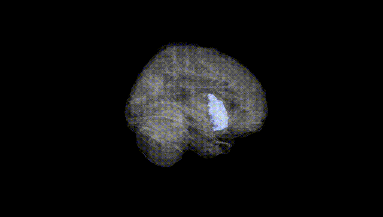
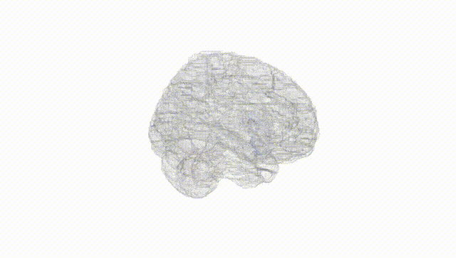
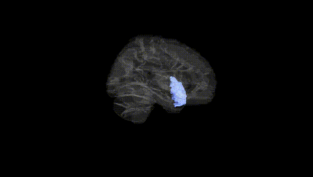
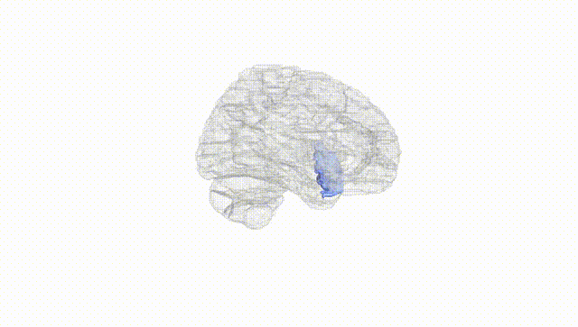
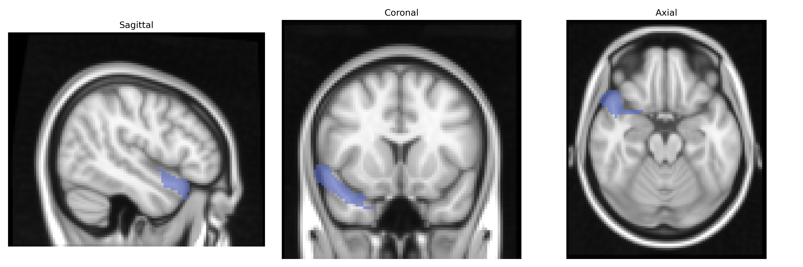
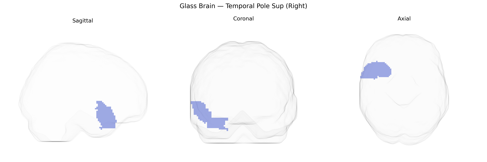

# Temporal Pole Sup (Right)
 
## Overview
 
The right Temporal Pole Sup (Right) region in the AAL atlas corresponds to the superior portion of the right temporal pole, typically encompassing the most anterior segment of the superior temporal gyrus in the right hemisphere. This area is part of the temporal association cortex and is implicated in high-level socio-emotional and semantic processing, including integration of multimodal sensory information, retrieval of conceptual knowledge, and aspects of emotional evaluation and social cognition. Structurally, it is situated anterior to the middle and superior temporal gyri and lies ventral to the frontal lobe, with strong connectivity to limbic and prefrontal regions. There is no direct Wikipedia article for this exact AAL label; a closely related structure is the [Temporal pole](https://en.wikipedia.org/wiki/Temporal_pole).
 
The right superior temporal pole (AAL “Temporal_Pole_Sup_R”) has been implicated in several imaging–genetics and GWAS-based endophenotype studies, which collectively highlight polygenic influences involving synaptic, neurodevelopmental, and psychiatric risk loci rather than a single dominant gene. Structural and functional variation in this region has been associated with common variants in genes related to synaptic plasticity and neurodevelopment (e.g., BDNF, DISC1, NRG1, and COMT) in candidate-gene and small-scale imaging-genetics work, and more recent large GWAS of cortical thickness and surface area have identified widespread polygenic effects—enriched for neuronal and synaptic pathways—that include the anterior and superior temporal regions encompassing the temporal pole. Genetic risk scores for schizophrenia, bipolar disorder, and major depressive disorder show associations with altered temporal pole volume or connectivity, consistent with convergent evidence that this area is affected in psychotic and mood disorders. In addition, temporal pole structural and functional metrics, including those in the right superior subdivision, have been linked to polygenic scores for autism spectrum disorder and social-cognition traits, reflecting the region’s role in theory of mind, semantic processing, and emotion. Neurodegenerative conditions such as frontotemporal dementia and Alzheimer’s disease, in which temporal pole atrophy is common, show associations between disease-risk variants (e.g., in MAPT, GRN, C9orf72, APOE) and more pronounced temporal pole degeneration, though these effects are typically reported at the lobar or anterior temporal level rather than specifically confined to the AAL-defined Right Temporal Pole Sup.
 
*Overview generated by GPT-4o (2026).*
 
---
 
**Region ID:** 8122  
**Hemisphere:** right  
**Atlas:** AAL 
 
---
 
## Temporal Pole Sup (Right) – Black Background (Full Brain)
 

 
**Full Quality Version:** <a href="full_black.mp4" download>Download MP4</a>
 
---
 
## Temporal Pole Sup (Right) – White Background (Full Brain)
 

 
**Full Quality Version:** <a href="full_white.mp4" download>Download MP4</a>
 
---

## Temporal Pole Sup (Right) – Black Background (Hemisphere)
 

 
**Full Quality Version:** <a href="hemi_black.mp4" download>Download MP4</a>
 
---
 
## Temporal Pole Sup (Right) – White Background (Hemisphere)
 

 
**Full Quality Version:** <a href="hemi_white.mp4" download>Download MP4</a>
 
---

## Triplanar View – T1 Background
 

 
---
 
## Triplanar View – Ghost Brain
 


