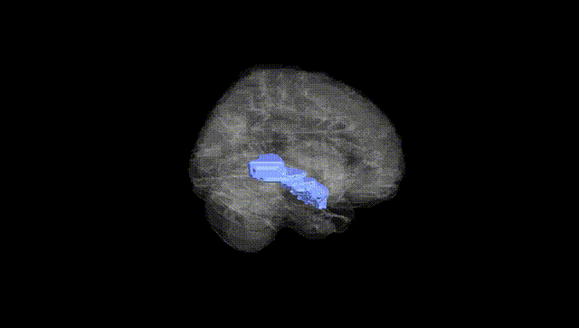
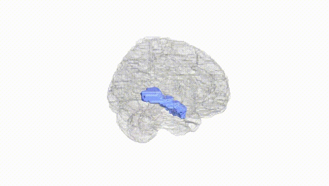
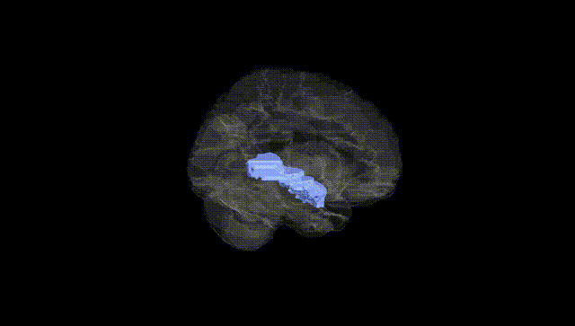
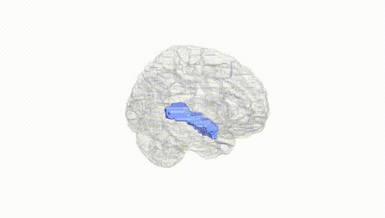
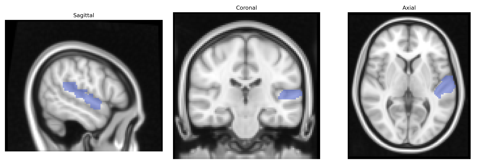
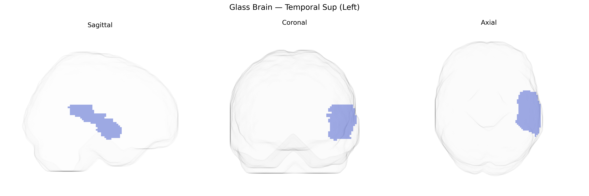

# Temporal Sup (Left)
 
## Overview
 
The left Temporal Sup (Left) region in the AAL atlas corresponds primarily to the left superior temporal gyrus, a cortical structure located on the lateral surface of the temporal lobe, extending from the temporal pole posteriorly toward the parietal lobe and bounded superiorly by the lateral sulcus (Sylvian fissure). This gyrus encompasses key auditory association areas, including portions of the primary and secondary auditory cortex, and plays a central role in processing complex sounds, speech perception, and aspects of language comprehension, particularly in the dominant (usually left) hemisphere where it contributes to phonological and lexical-semantic processing. It is structurally interconnected with frontal, parietal, and other temporal regions via major white matter pathways, supporting integration of auditory input with higher-order cognitive and linguistic functions. [Superior temporal gyrus](https://en.wikipedia.org/wiki/Superior_temporal_gyrus)
 
The left superior temporal gyrus (often corresponding to “Temporal Sup (Left)” in the AAL atlas) shows genetic associations primarily related to language, auditory processing, and psychosis risk, with multiple genome-wide association studies (GWAS) implicating variants that affect its volume, cortical thickness, and functional properties. Large imaging–genetics consortia (e.g., ENIGMA, UK Biobank) have identified common variants near genes involved in neurodevelopment, synaptic function, and axon guidance—such as those in or near FOXP2, DCDC2, KIAA0319, LRP1B, and GRIN2B—as contributors to structural variation in the superior temporal cortex, which in turn has been linked to reading and language abilities, dyslexia, and specific language impairment. Schizophrenia and related psychotic disorders show robust genetic and imaging evidence of left superior temporal gyrus abnormalities, with risk loci (including variants near CACNA1C, ZNF804A, and MIR137-regulated networks) associated with reduced gray matter, altered auditory and language-related activation, and increased susceptibility to auditory verbal hallucinations. Additional GWAS and polygenic score analyses connect left superior temporal measures with autism spectrum traits, social communication difficulties, and general cognitive performance, suggesting that genetically influenced variation in this region contributes to a spectrum of language, social-cognitive, and psychiatric phenotypes.
 
*Overview generated by GPT-4o (2026).*
 
---
 
**Region ID:** 8111  
**Hemisphere:** left  
**Atlas:** AAL 
 
---
 
## Temporal Sup (Left) – Black Background (Full Brain)
 

 
**Full Quality Version:** <a href="full_black.mp4" download>Download MP4</a>
 
---
 
## Temporal Sup (Left) – White Background (Full Brain)
 

 
**Full Quality Version:** <a href="full_white.mp4" download>Download MP4</a>
 
---

## Temporal Sup (Left) – Black Background (Hemisphere)
 

 
**Full Quality Version:** <a href="hemi_black.mp4" download>Download MP4</a>
 
---
 
## Temporal Sup (Left) – White Background (Hemisphere)
 

 
**Full Quality Version:** <a href="hemi_white.mp4" download>Download MP4</a>
 
---

## Triplanar View – T1 Background
 

 
---
 
## Triplanar View – Ghost Brain
 


