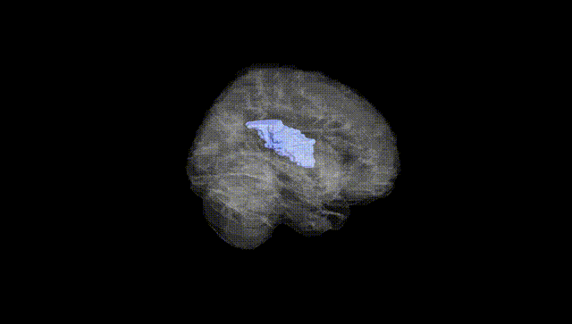
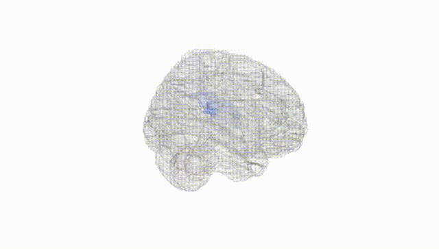
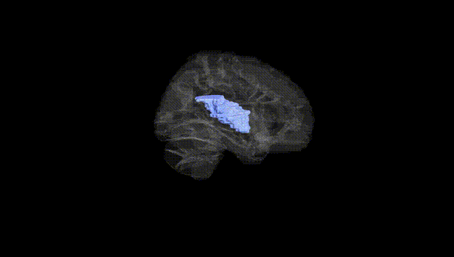
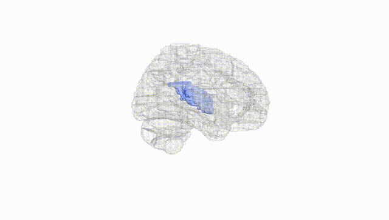
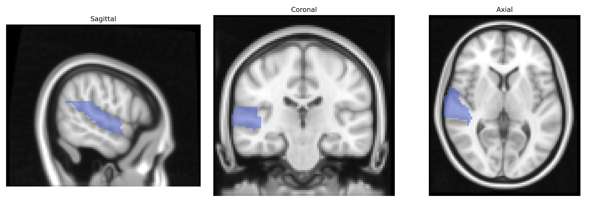
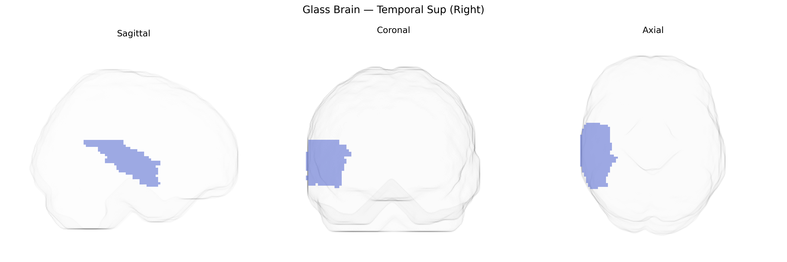

# Temporal Sup (Right)
 
## Overview
 
The Right Temporal Sup region in the AAL atlas corresponds to the right superior temporal gyrus, a cortical area located on the lateral surface of the temporal lobe, superior to the middle temporal gyrus and bounded dorsally by the lateral (Sylvian) fissure. Cytoarchitectonically, it includes primary and secondary auditory cortices (e.g., Brodmann areas 41 and 42) and parts of association auditory cortex (portions of BA22), supporting early sensory processing of acoustic stimuli, sound localization, and complex auditory pattern analysis. Functionally, the right superior temporal gyrus is particularly implicated in nonverbal auditory processing such as music perception, prosody, and aspects of social communication (e.g., processing vocal emotional cues), and it participates in broader temporo-parietal networks linked to language, auditory memory, and multimodal integration.  
[Superior temporal gyrus](https://en.wikipedia.org/wiki/Superior_temporal_gyrus)
 
The right superior temporal gyrus (right Temporal Sup in the AAL atlas) has been implicated in several genetic and GWAS-based neuroimaging and psychiatric findings, though typically as part of broader temporal or temporoparietal networks rather than in isolation. Imaging genetics studies from large cohorts such as ENIGMA and UK Biobank have identified common variants associated with right superior temporal cortical thickness, surface area, and volume, including loci near genes involved in neurodevelopment and synaptic function (for example, variants in or near genes such as GRIN2A, BDNF, and MIR137-related regions in some cortical-structure GWAS), and polygenic scores for schizophrenia, autism spectrum disorder, and educational attainment have been associated with structural and functional variation in this region. Right superior temporal abnormalities—often genetically modulated—have been reported in disorders such as schizophrenia, bipolar disorder, autism spectrum disorder, and language or social communication impairments, where risk variants in genes related to glutamatergic signaling, neuronal migration, and synaptic plasticity contribute to altered structure or connectivity. GWAS of auditory processing, speech and language traits, and social cognition have also shown that polygenic architectures influencing these phenotypes are associated with right temporal lobe activation or morphology, positioning the right superior temporal gyrus as a convergent site where distributed genetic effects on perception, language, and social cognition manifest in brain structure and function.
 
*Overview generated by GPT-4o (2026).*
 
---
 
**Region ID:** 8112  
**Hemisphere:** right  
**Atlas:** AAL 
 
---
 
## Temporal Sup (Right) – Black Background (Full Brain)
 

 
**Full Quality Version:** <a href="full_black.mp4" download>Download MP4</a>
 
---
 
## Temporal Sup (Right) – White Background (Full Brain)
 

 
**Full Quality Version:** <a href="full_white.mp4" download>Download MP4</a>
 
---

## Temporal Sup (Right) – Black Background (Hemisphere)
 

 
**Full Quality Version:** <a href="hemi_black.mp4" download>Download MP4</a>
 
---
 
## Temporal Sup (Right) – White Background (Hemisphere)
 

 
**Full Quality Version:** <a href="hemi_white.mp4" download>Download MP4</a>
 
---

## Triplanar View – T1 Background
 

 
---
 
## Triplanar View – Ghost Brain
 


