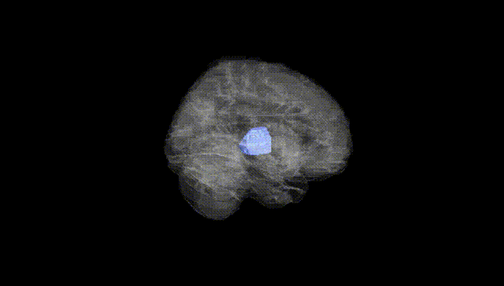
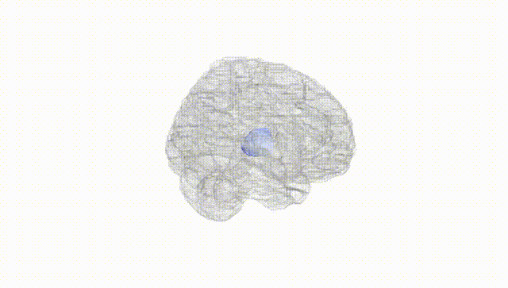
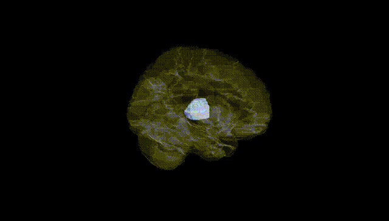
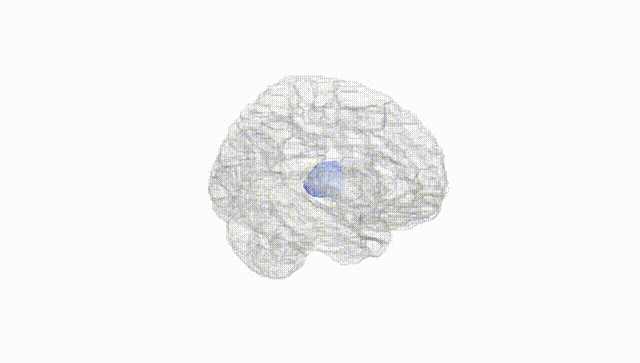
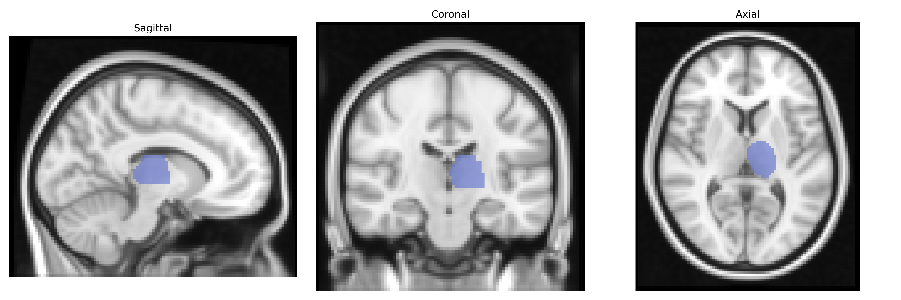
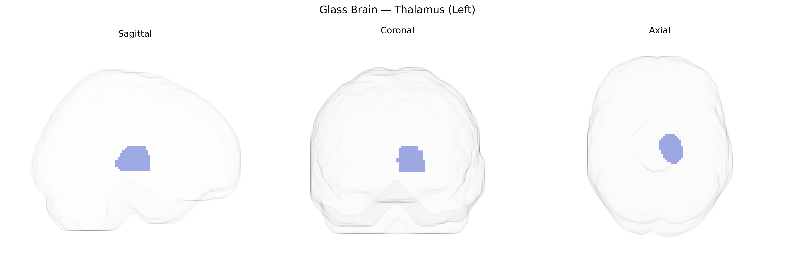

# Thalamus (Left)
 
## Overview
 
The left thalamus is a paired, ovoid diencephalic structure composed of multiple nuclei that serve as a major relay and integration center for sensory, motor, and associative information projecting to the cerebral cortex. It receives ascending input from sensory pathways (excluding olfaction), basal ganglia, cerebellum, and brainstem, and distributes processed signals to corresponding cortical regions, thereby contributing to perception, motor control, consciousness, and cognitive functions such as attention and memory. Functionally, individual thalamic nuclei maintain topographic and modality-specific connections, supporting lateralized processes in the left hemisphere, including language-related and higher-order associative functions. The AAL Atlas “Thalamus (Left)” label corresponds to this left-sided thalamic complex as a single region of interest, aggregating its constituent nuclei for neuroimaging and connectivity analyses. [Thalamus](https://en.wikipedia.org/wiki/Thalamus)
 
Genetic associations for left thalamic volume and function, as defined in AAL-based neuroimaging studies, implicate multiple common variants and pathways rather than a single major locus. Large GWAS of subcortical brain volumes (e.g., ENIGMA, UK Biobank) have identified thalamus-associated variants in or near genes involved in neurodevelopment, synaptic function, and axonal guidance—such as MAPT, NPTN, and loci near BDNF and GRIN2B—with effects generally shared across left and right thalamus but sometimes showing hemispheric asymmetry. Polygenic risk for schizophrenia, major depressive disorder, bipolar disorder, and ADHD has been associated with altered thalamic volume and connectivity, and specific risk loci for schizophrenia (e.g., within the MHC region on chromosome 6 and genes like CACNA1C and GRM3) show downstream associations with thalamocortical circuitry. GWAS of cognitive traits (intelligence, educational attainment, processing speed) also link polygenic scores to thalamic volume and network organization, consistent with the thalamus’s role in information integration. In Parkinson’s disease, multiple system atrophy, and other movement disorders, risk variants in genes related to dopaminergic and synuclein pathways (e.g., SNCA, LRRK2) have been indirectly tied to microstructural and volumetric changes in the thalamus, including the left side, through imaging–genetics analyses. Overall, current evidence supports a highly polygenic architecture in which variants influencing neurodevelopmental signaling, synaptic plasticity, and immune and calcium-channel pathways contribute to individual differences and disease-related alterations in left thalamic structure and function.
 
*Overview generated by GPT-4o (2026).*
 
---
 
**Region ID:** 7101  
**Hemisphere:** left  
**Atlas:** AAL 
 
---
 
## Thalamus (Left) – Black Background (Full Brain)
 

 
**Full Quality Version:** <a href="full_black.mp4" download>Download MP4</a>
 
---
 
## Thalamus (Left) – White Background (Full Brain)
 

 
**Full Quality Version:** <a href="full_white.mp4" download>Download MP4</a>
 
---

## Thalamus (Left) – Black Background (Hemisphere)
 

 
**Full Quality Version:** <a href="hemi_black.mp4" download>Download MP4</a>
 
---
 
## Thalamus (Left) – White Background (Hemisphere)
 

 
**Full Quality Version:** <a href="hemi_white.mp4" download>Download MP4</a>
 
---

## Triplanar View – T1 Background
 

 
---
 
## Triplanar View – Ghost Brain
 


