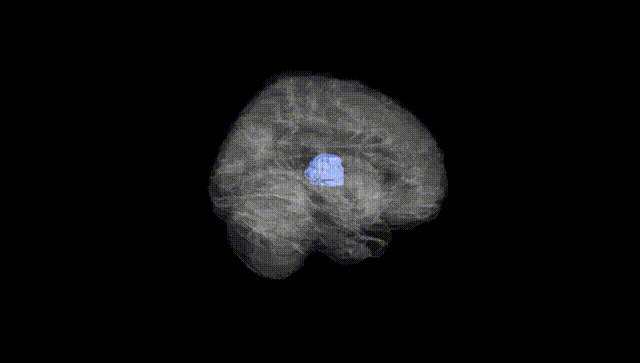
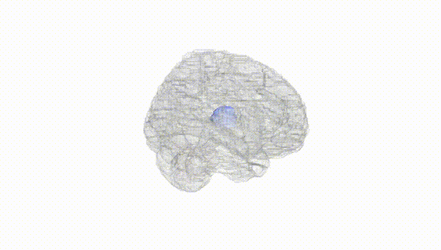
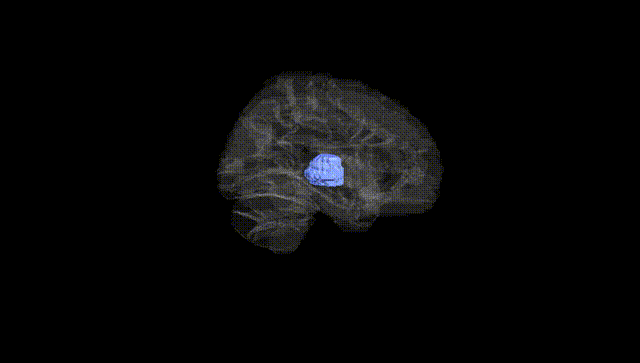
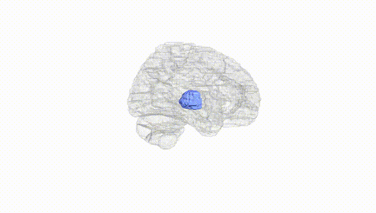
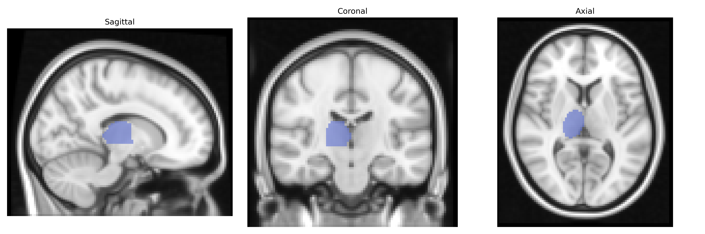
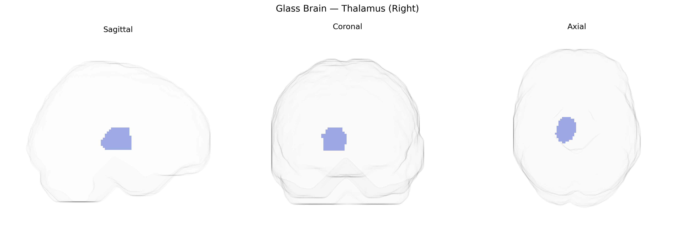

# Thalamus (Right)
 
## Overview
 
The right thalamus is a paired, ovoid gray matter structure located deep within the diencephalon, forming the lateral walls of the third ventricle and serving as a major relay and integration center for sensory, motor, and associative information. In the AAL atlas, the right thalamus is typically treated as a single region encompassing multiple nuclei, including relay nuclei for somatosensory, visual, and auditory pathways, as well as nuclei involved in motor circuits with the basal ganglia and cerebellum, and associative circuits with the prefrontal and limbic cortices. It receives afferents from subcortical structures (such as the spinal cord, brainstem, basal ganglia, and cerebellum) and projects extensively to the ipsilateral cerebral cortex, thereby modulating perception, arousal, attention, and aspects of consciousness. Functionally, the right thalamus participates in lateralized processes such as spatial attention and aspects of visuospatial integration, while also contributing to general thalamocortical oscillatory activity important for sleep–wake regulation and sensorimotor gating. [Thalamus](https://en.wikipedia.org/wiki/Thalamus)
 
The right thalamus, as defined in the AAL atlas, shows robust heritability and multiple genome-wide associations implicating genes involved in neurodevelopment, synaptic function, and neurodegeneration. Large neuroimaging GWAS (e.g., ENIGMA, UK Biobank) have identified variants in and near genes such as MAPT, SLC39A8, DCC, GRIN2A, DRD2, and TCF4 associated with thalamic volume or shape, with some loci exhibiting hemisphere-specific or asymmetric effects. Several schizophrenia, bipolar disorder, major depression, and autism risk loci overlap with thalamus-related variants, suggesting shared genetic architecture between thalamic morphology and psychiatric susceptibility, while polygenic risk scores for schizophrenia, ADHD, and major depression show correlations with altered thalamic structure. Thalamic volume–associated variants also intersect with genes linked to neurodegenerative disorders (e.g., Alzheimer’s disease via MAPT and APOE-related pathways) and movement disorders, while common variants influencing iron metabolism, glutamatergic signaling, and dopaminergic transmission contribute to interindividual differences in right thalamic size and connectivity, thereby connecting this region’s genetics to cognition, sleep regulation, and sensorimotor integration.
 
*Overview generated by GPT-4o (2026).*
 
---
 
**Region ID:** 7102  
**Hemisphere:** right  
**Atlas:** AAL 
 
---
 
## Thalamus (Right) – Black Background (Full Brain)
 

 
**Full Quality Version:** <a href="full_black.mp4" download>Download MP4</a>
 
---
 
## Thalamus (Right) – White Background (Full Brain)
 

 
**Full Quality Version:** <a href="full_white.mp4" download>Download MP4</a>
 
---

## Thalamus (Right) – Black Background (Hemisphere)
 

 
**Full Quality Version:** <a href="hemi_black.mp4" download>Download MP4</a>
 
---
 
## Thalamus (Right) – White Background (Hemisphere)
 

 
**Full Quality Version:** <a href="hemi_white.mp4" download>Download MP4</a>
 
---

## Triplanar View – T1 Background
 

 
---
 
## Triplanar View – Ghost Brain
 


