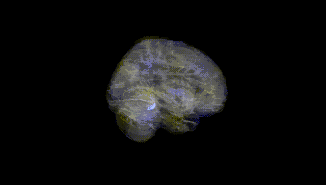
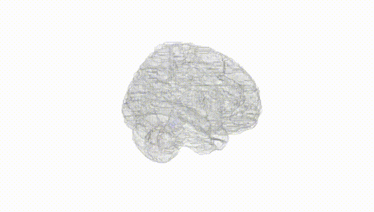
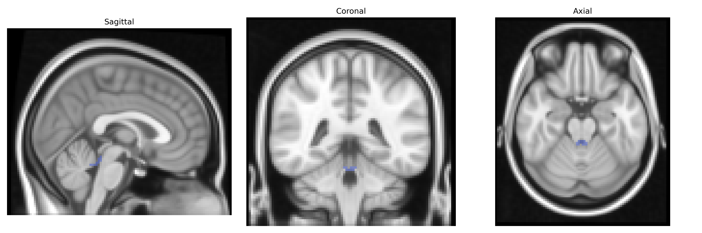
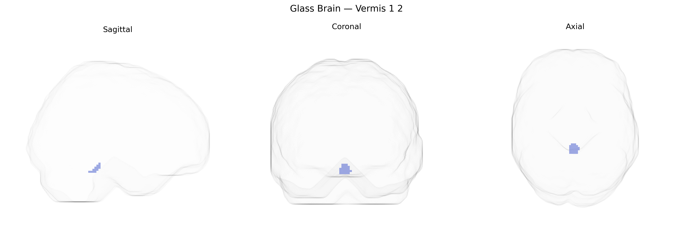

# Vermis 1 2
 
## Overview
 
The **bilateral Vermis 1–2** region in the AAL atlas corresponds to the anterior segments of the cerebellar vermis, located medially between the cerebellar hemispheres and comprising parts of lobules I–II. This region is primarily associated with the regulation of posture, balance, and axial motor control, integrating somatosensory and vestibular inputs to modulate tone and coordination of trunk and proximal limb musculature. Functionally, Vermis 1–2 participates in sensorimotor cerebellar circuits that project to brainstem and thalamic nuclei, influencing motor execution and adaptation. There is no direct Wikipedia article for Vermis 1–2 as defined in the AAL atlas; a closely related structure is the cerebellar vermis: [Cerebellar vermis](https://en.wikipedia.org/wiki/Vermis_of_cerebellum).
 
The bilateral Vermis 1–2 region (anterior cerebellar vermis) in the AAL atlas has limited direct region-specific genetic association data, but converging evidence from cerebellar imaging genetics and GWAS implicates it within broader cerebellar and vermal circuits linked to neurodevelopmental and psychiatric traits. Large-scale brain imaging GWAS (e.g., ENIGMA, UK Biobank) have identified numerous loci influencing total cerebellar and vermis volumes—frequently involving neurodevelopmental and synaptic genes such as PAPPA2, KIAA0319, and DLG2—though findings are usually reported at lobular or global cerebellar levels rather than specifically Vermis 1–2. Vermal volume and morphology, influenced by polygenic risk for schizophrenia, bipolar disorder, autism spectrum disorder, and ADHD, have been repeatedly associated with these conditions, and polygenic risk scores for psychosis and mood disorders correlate with cerebellar and vermal structural variation. Genetic studies in autism and schizophrenia have linked risk variants in synaptic and neurodevelopmental pathways (e.g., glutamatergic and GABAergic signaling genes) to cerebellar anomalies, including anterior vermis hypoplasia or altered connectivity. Additionally, GWAS of motor coordination, balance, and cognitive traits (such as processing speed and working memory) implicate genes that modulate cerebellar development and plasticity, suggesting that Vermis 1–2 participates in genetically influenced motor and cognitive circuits. However, current evidence is largely indirect and region-agnostic, and no major GWAS has yet reported robust, Vermis 1–2–specific genetic associations or disorder-linked loci at the fine-grained AAL parcel level.
 
*Overview generated by GPT-4o (2026).*
 
---
 
**Region ID:** 9100  
**Hemisphere:** bilateral  
**Atlas:** AAL 
 
---
 
## Vermis 1 2 – Black Background (Full Brain)
 

 
**Full Quality Version:** <a href="full_black.mp4" download>Download MP4</a>
 
---
 
## Vermis 1 2 – White Background (Full Brain)
 

 
**Full Quality Version:** <a href="full_white.mp4" download>Download MP4</a>
 
---

## Triplanar View – T1 Background
 

 
---
 
## Triplanar View – Ghost Brain
 


