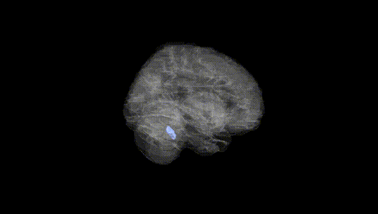
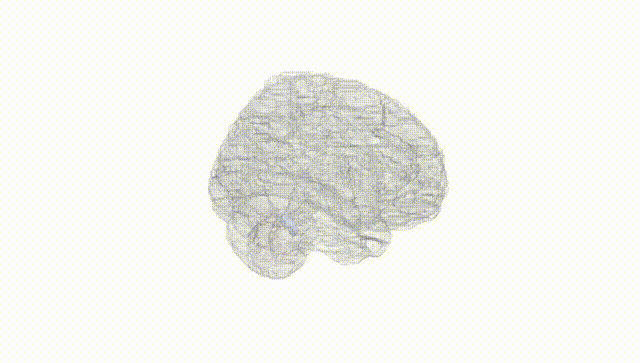
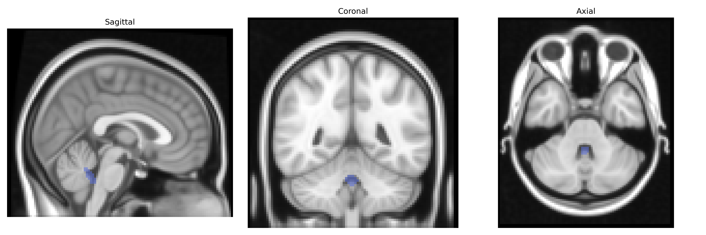
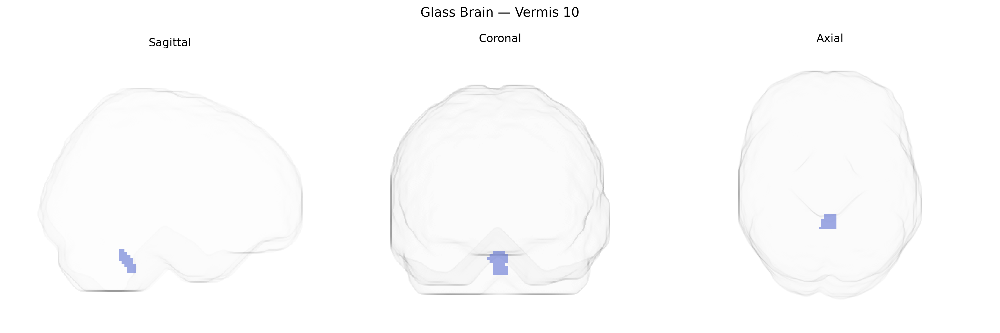

# Vermis 10
 
## Overview
 
The bilateral Vermis 10 region in the AAL atlas corresponds to the nodulus of the cerebellar vermis, located in the inferior portion (posterior lobe) of the cerebellum and forming part of the flocculonodular lobe. It is structurally characterized by small, tightly folded cortical lamellae and is cytoarchitectonically composed of the typical trilaminar cerebellar cortex (molecular layer, Purkinje cell layer, and granular layer) overlying deep cerebellar nuclei connections. Functionally, Vermis 10 plays a critical role in vestibulocerebellar circuits, contributing to balance, posture, and the coordination of eye and head movements, especially in the integration of vestibular input for gaze stabilization and equilibrium. There is no direct Wikipedia article specifically for “Vermis 10”; a related structure within which it is located is the [Cerebellar vermis](https://en.wikipedia.org/wiki/Cerebellar_vermis).
 
Current genetic association literature rarely isolates bilateral Vermis 10 as a distinct target, but midline cerebellar structures, including vermal lobule X, are implicated across several GWAS and imaging-genetics studies of brain structure and neuropsychiatric traits. Large-scale GWAS of brain volumes and cortical/cerebellar morphology (e.g., ENIGMA, UK Biobank) have identified loci—such as variants near KIAA0586, DLG2, and MAPT—associated with cerebellar volume and shape, sometimes including posterior/inferior vermis regions overlapping AAL Vermis 10. In psychiatric genetics, polygenic risk scores for schizophrenia, bipolar disorder, autism spectrum disorder, and major depression have been associated with structural and functional alterations in the cerebellar vermis, and candidate gene and GWAS-follow up work suggests that synaptic and neurodevelopmental genes (e.g., CACNA1C, NRXN1) that influence cortico-cerebellar circuits may contribute to these effects. Imaging-genetics studies of cognitive traits and emotional regulation show that common variants affecting glutamatergic and GABAergic signaling, and genes involved in developmental patterning of the hindbrain, modulate connectivity of Vermis 10 with limbic and prefrontal regions, linking this area to anxiety, mood instability, and balance or vestibular functions. However, no robust, widely replicated GWAS has yet pinpointed variants uniquely and specifically associated with bilateral Vermis 10 volume or function, and most genetic findings involve broader cerebellar or vermal phenotypes rather than this AAL-defined subregion alone.
 
*Overview generated by GPT-4o (2026).*
 
---
 
**Region ID:** 9170  
**Hemisphere:** bilateral  
**Atlas:** AAL 
 
---
 
## Vermis 10 – Black Background (Full Brain)
 

 
**Full Quality Version:** <a href="full_black.mp4" download>Download MP4</a>
 
---
 
## Vermis 10 – White Background (Full Brain)
 

 
**Full Quality Version:** <a href="full_white.mp4" download>Download MP4</a>
 
---

## Triplanar View – T1 Background
 

 
---
 
## Triplanar View – Ghost Brain
 


