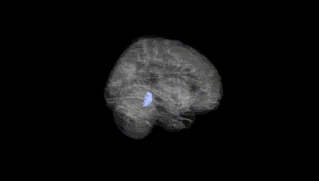
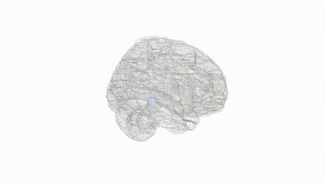
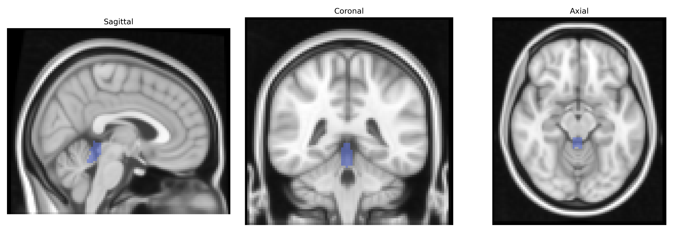
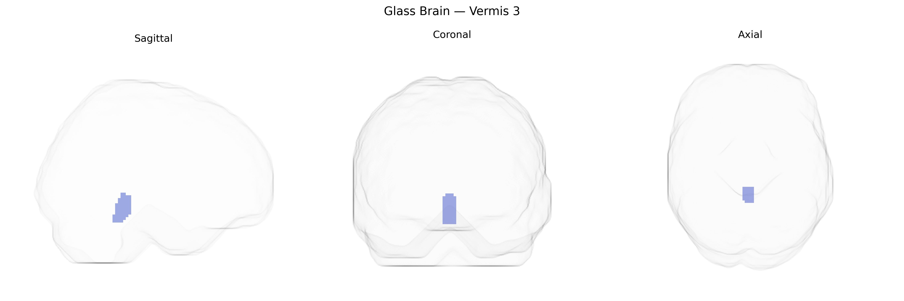

# Vermis 3
 
## Overview
 
The bilateral Vermis 3 region in the AAL atlas corresponds to a midline segment of the cerebellar vermis located within the anterior lobe, often associated with lobules III–IV, which participate in coordination of posture, gait, and proximal limb movements. This region receives proprioceptive and vestibular inputs and projects via deep cerebellar nuclei to brainstem and thalamic structures involved in motor execution and balance, contributing to the regulation of axial musculature and fine-tuning of ongoing movements. Functional imaging studies implicate this area in sensorimotor integration and error correction during motor tasks, and lesions affecting the anterior vermis can lead to gait ataxia and truncal instability. There is no direct link for “Vermis 3,” but it is part of the [Cerebellar vermis](https://en.wikipedia.org/wiki/Cerebellar_vermis).
 
The bilateral Vermis 3 region in the AAL atlas, part of the anterior cerebellar vermis, has been implicated in several genetic and GWAS-based neuroimaging findings, although direct, Vermis 3–specific genetic associations remain sparse and typically emerge in broader cerebellar or vermal analyses. Imaging genetics studies using large cohorts (such as ENIGMA and UK Biobank) have identified heritable variation in cerebellar volume and morphology, with loci in or near genes related to neurodevelopment and synaptic function—such as KIAA0319, DLG4, and various cell-adhesion and axon-guidance genes—showing associations to cerebellar and vermal measures that may encompass Vermis 3. Vermal regions including Vermis 3 have been repeatedly linked, via structural and functional MRI, to neurodevelopmental and psychiatric disorders such as autism spectrum disorder, schizophrenia, bipolar disorder, and attention-deficit/hyperactivity disorder, for which large GWAS have identified numerous risk loci (e.g., in CACNA1C, GRIN2A, and other synaptic and calcium-channel genes) that are expressed in cerebellar circuits, suggesting an indirect genetic contribution to Vermis 3 abnormalities. Cerebellar vermis alterations associated with risk variants in genes related to alcohol dependence and substance use (e.g., GABRA2, ADH/ALDH loci) have also been reported, particularly in studies of cerebellar volume and microstructure in addiction and impulsivity. Overall, current evidence indicates that genetic influences on neurodevelopmental, synaptic, and neuropsychiatric pathways affect anterior vermal structure and function, and Vermis 3 is likely involved as part of these broader cerebellar genetic architectures, but highly specific GWAS hits or single-gene associations targeting Vermis 3 alone have not yet been clearly established.
 
*Overview generated by GPT-4o (2026).*
 
---
 
**Region ID:** 9110  
**Hemisphere:** bilateral  
**Atlas:** AAL 
 
---
 
## Vermis 3 – Black Background (Full Brain)
 

 
**Full Quality Version:** <a href="full_black.mp4" download>Download MP4</a>
 
---
 
## Vermis 3 – White Background (Full Brain)
 

 
**Full Quality Version:** <a href="full_white.mp4" download>Download MP4</a>
 
---

## Triplanar View – T1 Background
 

 
---
 
## Triplanar View – Ghost Brain
 


