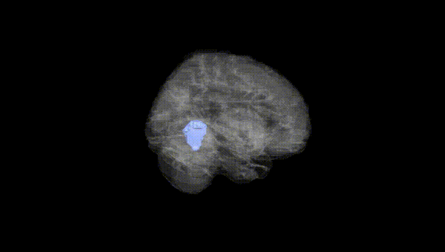
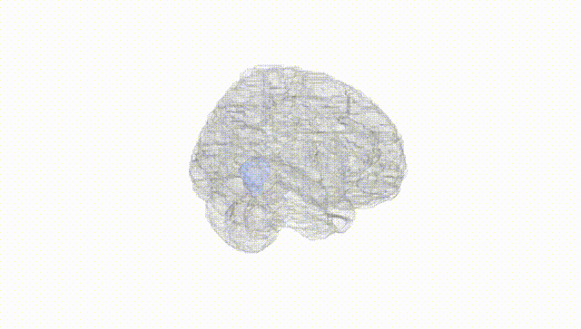
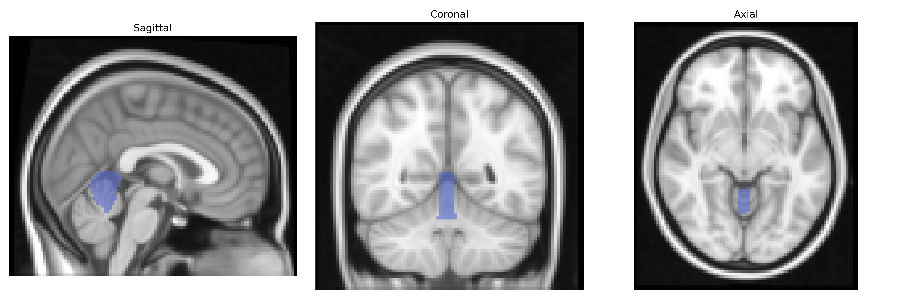
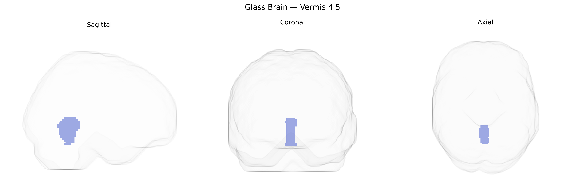

# Vermis 4 5
 
## Overview
 
Vermis 4–5, in the AAL atlas, refers to the bilateral midline cerebellar vermis encompassing lobules IV and V, located in the anterior lobe of the cerebellum. This region is primarily associated with the regulation of posture, muscle tone, and coordination of trunk and proximal limb movements through its role in the spinocerebellar circuitry and connections with the fastigial nucleus. Functionally, Vermis 4–5 contributes to fine-tuning ongoing motor activity and maintaining balance, integrating somatosensory input from the body to adjust motor output via descending pathways to spinal and brainstem motor centers. There is no direct Wikipedia article for “Vermis 4–5”; a related structure is the [Cerebellar vermis](https://en.wikipedia.org/wiki/Cerebellar_vermis).
 
Genetic associations specifically targeting the bilateral Vermis 4–5 region in the AAL atlas are limited, but several GWAS and imaging genetics studies implicate this midline cerebellar territory in traits and disorders with known heritable components. Variants in genes related to neurodevelopment, synaptic function, and neurotransmission (e.g., those involved in glutamatergic and GABAergic signaling) have been linked to cerebellar volume and morphology, and some voxel-based morphometry GWAS highlight cerebellar vermis regions as contributing to the heritability of total cerebellar and posterior fossa structures. The vermis, including lobules IV–V, shows altered structure or function in genetic neuropsychiatric conditions such as autism spectrum disorder, schizophrenia, and bipolar disorder, where risk loci in genes like CACNA1C, CNTNAP2, and others have been associated with abnormal cerebellar activation or connectivity, though these findings usually refer to cerebellar or vermal regions broadly rather than Vermis 4–5 specifically. Additionally, GWAS of cognitive traits, motor coordination, and affective symptoms have identified loci associated with variation in cerebellar volumes, including midline vermal sectors, suggesting that genetic influences on sensorimotor integration and emotion regulation may partially act through this region. However, to date, no large-scale GWAS has isolated Vermis 4–5 as a primary locus of association; most evidence comes from imaging-genetics analyses in which vermal subregions, including 4–5, contribute to broader cerebellar endophenotypes linked to neurodevelopmental, psychiatric, and cognitive traits.
 
*Overview generated by GPT-4o (2026).*
 
---
 
**Region ID:** 9120  
**Hemisphere:** bilateral  
**Atlas:** AAL 
 
---
 
## Vermis 4 5 – Black Background (Full Brain)
 

 
**Full Quality Version:** <a href="full_black.mp4" download>Download MP4</a>
 
---
 
## Vermis 4 5 – White Background (Full Brain)
 

 
**Full Quality Version:** <a href="full_white.mp4" download>Download MP4</a>
 
---

## Triplanar View – T1 Background
 

 
---
 
## Triplanar View – Ghost Brain
 


