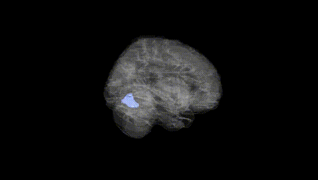
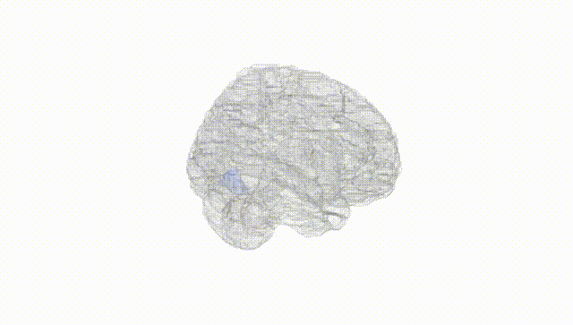
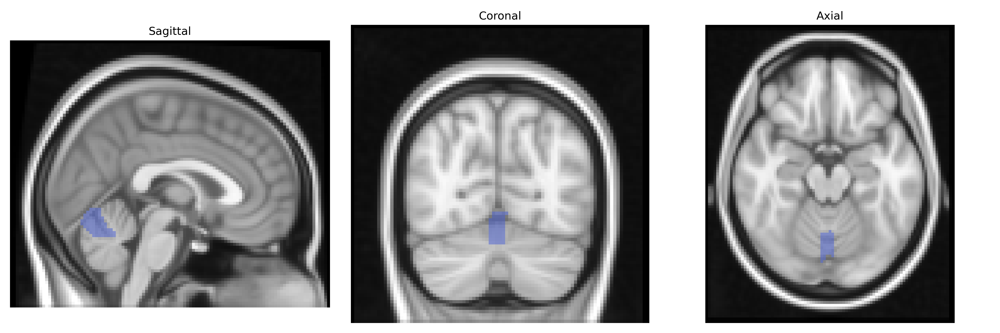
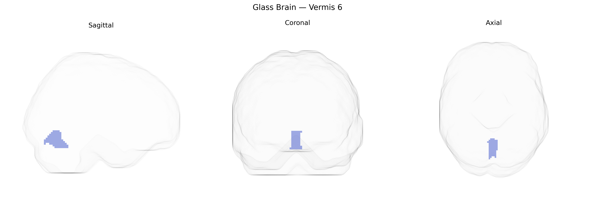

# Vermis 6
 
## Overview
 
The bilateral Vermis 6 region, as defined in the AAL atlas, corresponds to a midline segment of the cerebellar vermis located within lobule VI of the anterior–superior cerebellum. This region is composed primarily of cerebellar cortex and underlying white matter and is implicated in the modulation of motor control, posture, and oculomotor functions, while also contributing to higher-order processes such as cognitive timing and affective regulation through its connections with brainstem nuclei and thalamocortical circuits. Functionally, Vermis 6 participates in the fine-tuning of movement and coordination by integrating proprioceptive and vestibular inputs with cerebellar output pathways. There is no direct Wikipedia article for “Vermis 6”; a related article describing its broader anatomical context is [Cerebellar vermis](https://en.wikipedia.org/wiki/Vermis_of_cerebellum).
 
Bilateral Vermis 6 (AAL atlas) lies within the posterior cerebellar vermis, a region implicated in cognitive, affective, and sensorimotor processes, and has been indirectly linked to genetic variation through imaging-genetics and GWAS-based neuroimaging studies rather than region-specific gene discovery. Large consortia such as ENIGMA and UK Biobank have reported that common variants in genes involved in neurodevelopment, synaptic function, and cell adhesion (for example, loci near MAPT, RELN, and genes in calcium-channel and glutamatergic pathways) contribute to interindividual differences in cerebellar volume and morphology, including midline vermis regions, though Vermis 6 is typically analyzed as part of broader lobular or vermal measures. Polygenic risk scores for schizophrenia, major depressive disorder, bipolar disorder, and autism spectrum disorder have shown associations with altered cerebellar structure and connectivity encompassing posterior vermis lobules, and specific risk loci (such as those near CACNA1C, GRIN2A, and other neurodevelopmental genes) have been linked to cerebellar structural or functional variation in voxel-based and surface-based analyses that include Vermis 6. Additionally, genetic liability for neurodevelopmental traits (e.g., ADHD, cognitive ability, educational attainment) and for neurodegenerative disease (especially Alzheimer’s disease–related loci such as APOE) has been associated with differences in posterior cerebellar and vermal metrics in GWAS and polygenic imaging studies, though these effects are generally modest and spatially broad. No single gene or variant has been robustly identified as uniquely specific to bilateral Vermis 6, and current evidence supports a highly polygenic architecture in which many neurodevelopmental and synaptic genes exert small, distributed effects on this region as part of wider cerebellar and brain networks implicated in psychiatric, cognitive, and motor-related traits.
 
*Overview generated by GPT-4o (2026).*
 
---
 
**Region ID:** 9130  
**Hemisphere:** bilateral  
**Atlas:** AAL 
 
---
 
## Vermis 6 – Black Background (Full Brain)
 

 
**Full Quality Version:** <a href="full_black.mp4" download>Download MP4</a>
 
---
 
## Vermis 6 – White Background (Full Brain)
 

 
**Full Quality Version:** <a href="full_white.mp4" download>Download MP4</a>
 
---

## Triplanar View – T1 Background
 

 
---
 
## Triplanar View – Ghost Brain
 


