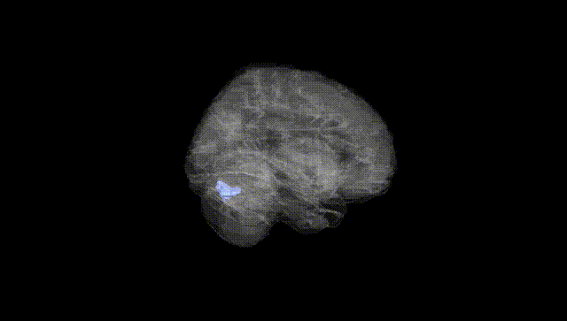
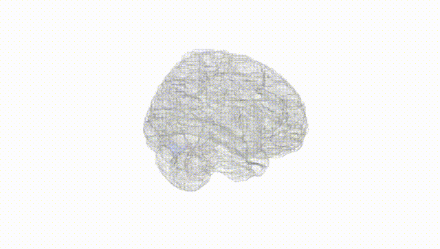
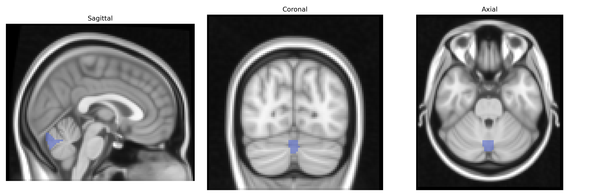
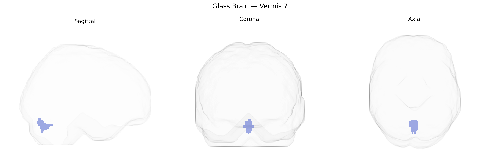

# Vermis 7
 
## Overview
 
The bilateral Vermis 7 region, as defined in the AAL atlas, corresponds to a midline segment of the posterior cerebellar vermis located within the lobule VII complex, which includes portions of the crus II and lobule VIIB. This vermal territory is implicated in higher-order cognitive and affective functions rather than primary motor control, and is involved in cerebellar contributions to executive processes, working memory, and emotional regulation via extensive connections with prefrontal and limbic cortices. Anatomically, Vermis 7 lies between more anterior motor-related vermal lobules and more caudal regions associated with visceromotor and affective integration, forming part of the “cognitive cerebellum” that participates in cerebro-cerebellar loops. There is no direct Wikipedia article for “Vermis 7”; a related and encompassing structure is the posterior cerebellar vermis: [Cerebellar vermis](https://en.wikipedia.org/wiki/Vermis_(cerebellum)).
 
Bilateral Vermis 7, a cerebellar midline region in the AAL atlas, has been implicated by imaging–genetics and GWAS-based neuroimaging studies as part of cerebellar volume and functional connectivity phenotypes influenced by common variants in genes related to neurodevelopment, synaptic function, and neuronal signaling (for example, loci near genes such as ATOH1, PAX3, and PLCL1 in large-scale cerebellar morphometry GWAS). Polygenic overlap has been reported between cerebellar vermis volumes (including Vermis 7) and risk for psychiatric and neurodevelopmental disorders, including major depressive disorder, schizophrenia, bipolar disorder, and autism spectrum disorder, consistent with cerebellar involvement in cognitive and affective circuits. Vermis 7 functional and structural alterations are frequently observed in disorders with known genetic components—such as autism, ADHD, and mood disorders—though these associations are generally mediated by distributed polygenic effects rather than Vermis 7–specific variants. Mendelian and CNV studies in syndromes affecting posterior fossa development (e.g., 3q29 deletion, 22q11.2 deletion, Joubert-related disorders) often show vermian hypoplasia or dysplasia that can involve Vermis 7, further linking this region to neurodevelopmental genetic risk. Overall, current evidence supports Vermis 7 as a genetically influenced cerebellar node within broader polygenic architectures for psychiatric, cognitive, and neurodevelopmental traits, but no single gene or variant has been identified as uniquely or specifically associated with this AAL-defined region.
 
*Overview generated by GPT-4o (2026).*
 
---
 
**Region ID:** 9140  
**Hemisphere:** bilateral  
**Atlas:** AAL 
 
---
 
## Vermis 7 – Black Background (Full Brain)
 

 
**Full Quality Version:** <a href="full_black.mp4" download>Download MP4</a>
 
---
 
## Vermis 7 – White Background (Full Brain)
 

 
**Full Quality Version:** <a href="full_white.mp4" download>Download MP4</a>
 
---

## Triplanar View – T1 Background
 

 
---
 
## Triplanar View – Ghost Brain
 


