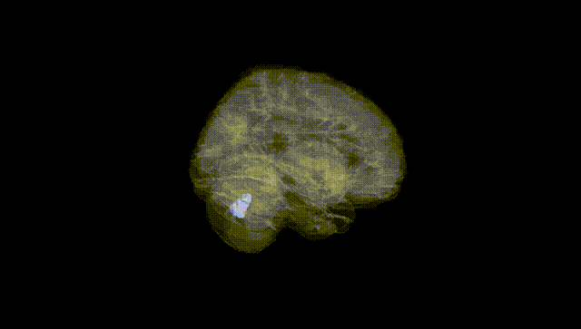
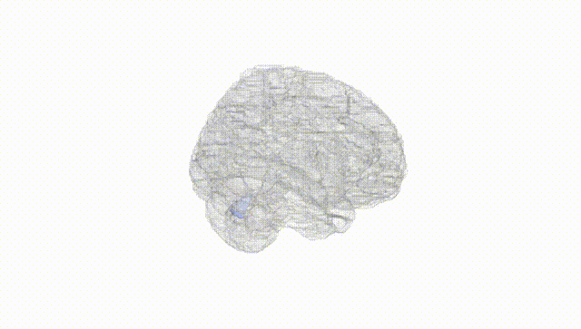
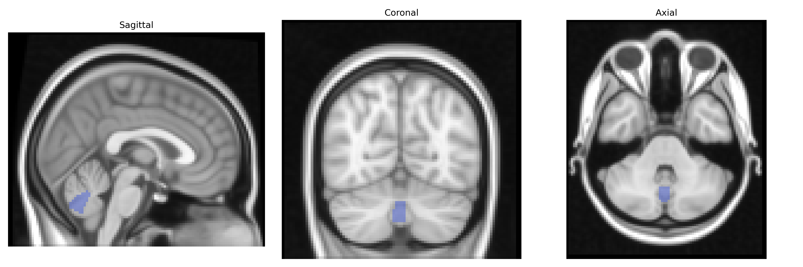
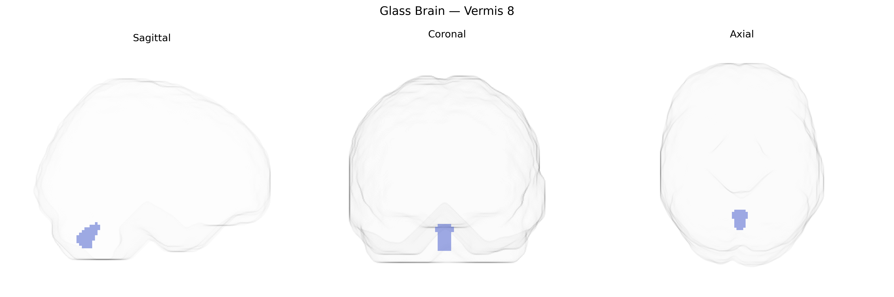

# Vermis 8
 
## Overview
 
The bilateral Vermis 8 region, as defined in the AAL Atlas, corresponds to a midline segment of the cerebellar vermis located within lobule VIII of the posterior lobe of the cerebellum. This region is implicated primarily in motor coordination and the fine-tuning of movements, particularly those related to posture, gait, and balance, and is thought to integrate somatosensory and vestibular inputs to modulate axial musculature. Functionally, Vermis 8 contributes to the timing and precision of motor output and may also participate in aspects of sensorimotor learning and adaptation. There is no direct link for “Vermis 8” as a stand-alone entry; a related structure is the cerebellar vermis: [Cerebellar vermis](https://en.wikipedia.org/wiki/Vermis_(cerebellum)).
 
The bilateral Vermis 8 region in the AAL atlas, part of the posterior cerebellar vermis, has been implicated in several genetic and imaging‑genetic studies, although direct, vermis‑specific GWAS findings are relatively sparse. Variants in genes involved in cerebellar development and synaptic function—such as CACNA1A, GRID2, and FOXP2—have been associated with cerebellar structure and function, and imaging genetics work has linked common SNPs in neurodevelopmental and neuropsychiatric genes (including those in glutamatergic and GABAergic pathways) to volumetric and activation differences in midline cerebellar regions encompassing Vermis 8. GWAS of brain morphology have identified loci (for example near HMGA2, KIAA0586, and other neurodevelopmental genes) associated with cerebellar volume and lobular measures that likely overlap Vermis 8, and cerebellar vermis abnormalities have been reported in genetic neurodevelopmental disorders such as autism spectrum disorder, schizophrenia, and attention‑deficit/hyperactivity disorder, as well as in mood disorders, where polygenic risk scores for these conditions correlate with altered cerebellar vermis structure or connectivity. Additionally, genetic factors linked to motor coordination, cognitive control, and affect regulation—traits consistently involving posterior cerebellar networks—have been associated in GWAS and post‑hoc imaging‑genetics analyses with activity and morphology in cerebellar vermis regions that include Vermis 8, suggesting that this area participates in genetically influenced circuits for sensorimotor integration and higher‑order emotional and cognitive processing.
 
*Overview generated by GPT-4o (2026).*
 
---
 
**Region ID:** 9150  
**Hemisphere:** bilateral  
**Atlas:** AAL 
 
---
 
## Vermis 8 – Black Background (Full Brain)
 

 
**Full Quality Version:** <a href="full_black.mp4" download>Download MP4</a>
 
---
 
## Vermis 8 – White Background (Full Brain)
 

 
**Full Quality Version:** <a href="full_white.mp4" download>Download MP4</a>
 
---

## Triplanar View – T1 Background
 

 
---
 
## Triplanar View – Ghost Brain
 


