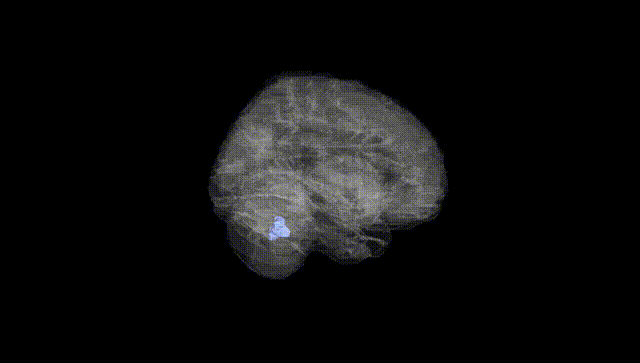
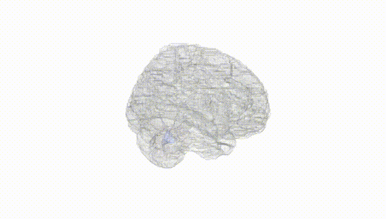
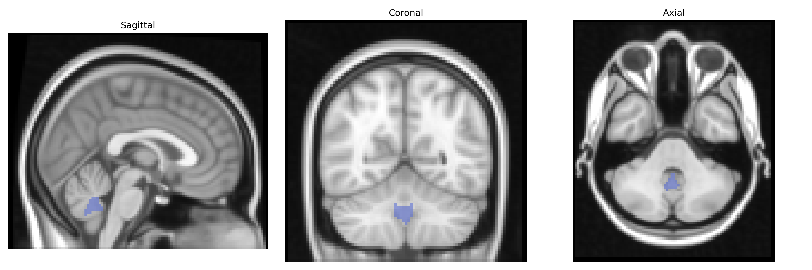
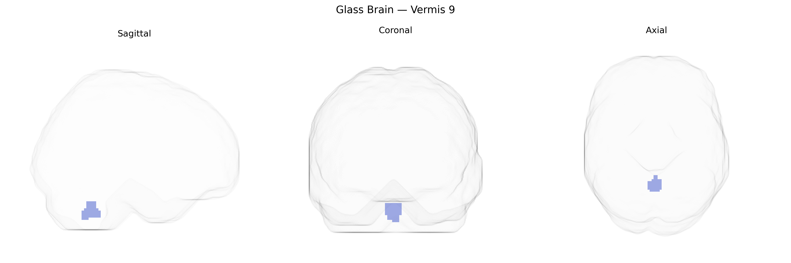

# Vermis 9
 
## Overview
 
The bilateral Vermis 9 region, as defined in the AAL atlas, corresponds to a segment of the inferior cerebellar vermis located in the posterior lobe of the cerebellum, forming part of the midline structure that integrates bilateral cerebellar hemispheric activity. Functionally, this region is implicated in coordination of posture, balance, and axial musculature, and contributes to the modulation of motor execution as well as aspects of affective and cognitive processing via its connections with vestibular, brainstem, and cortical circuits. In neuroimaging studies, Vermis 9 is often associated with networks subserving sensorimotor integration and oculomotor control, and lesion or dysfunction in this area has been linked to disturbances in gait, truncal ataxia, and certain cerebellar cognitive–affective syndromes. There is no direct Wikipedia article for “Vermis 9”; a related structure is the [Cerebellar vermis](https://en.wikipedia.org/wiki/Vermis_(cerebellum)).
 
The bilateral Vermis 9 region in the AAL atlas, part of the posterior cerebellar vermis implicated in affective and cognitive modulation, has been indirectly linked to several genetic associations through imaging genetics and GWAS of brain structure and related traits, though few studies target Vermis 9 specifically at high anatomical resolution. Large neuroimaging GWAS (e.g., ENIGMA, UK Biobank) have identified multiple loci influencing cerebellar volume and morphology—often involving genes related to neurodevelopment, synaptic function, and axon guidance (such as variants near KIAA0586, PAX3, and DAAM1)—and some of these effects extend to midline vermal regions that encompass Vermis 9. Genetic correlations and polygenic score analyses indicate that cerebellar vermis structure is associated with psychiatric and neurodevelopmental conditions including major depressive disorder, schizophrenia, bipolar disorder, autism spectrum disorder, and ADHD, as well as traits like neuroticism and cognitive performance, though these are typically reported at the level of the cerebellum or vermis rather than Vermis 9 alone. Additional work using candidate gene or polygenic approaches links vermal alterations to genes involved in serotonergic and glutamatergic signaling and to alleles conferring risk for mood and anxiety disorders, consistent with the role of the posterior vermis in emotional regulation. Overall, existing genetic evidence supports an association between common genetic variation and structural or functional differences in the cerebellar vermis that likely includes AAL Vermis 9, but specific, robust GWAS hits uniquely attributed to this subregion have not yet been clearly delineated in the literature.
 
*Overview generated by GPT-4o (2026).*
 
---
 
**Region ID:** 9160  
**Hemisphere:** bilateral  
**Atlas:** AAL 
 
---
 
## Vermis 9 – Black Background (Full Brain)
 

 
**Full Quality Version:** <a href="full_black.mp4" download>Download MP4</a>
 
---
 
## Vermis 9 – White Background (Full Brain)
 

 
**Full Quality Version:** <a href="full_white.mp4" download>Download MP4</a>
 
---

## Triplanar View – T1 Background
 

 
---
 
## Triplanar View – Ghost Brain
 


