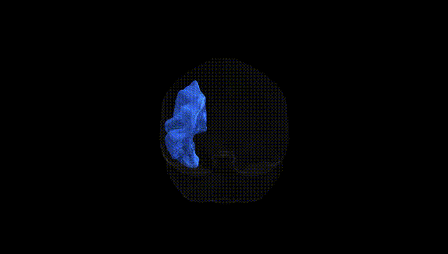
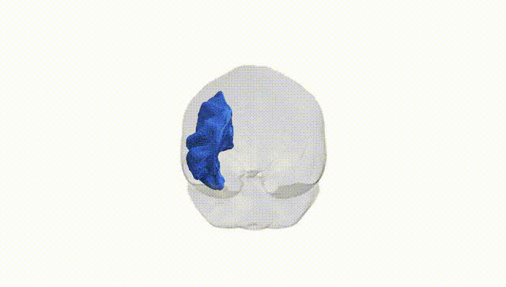
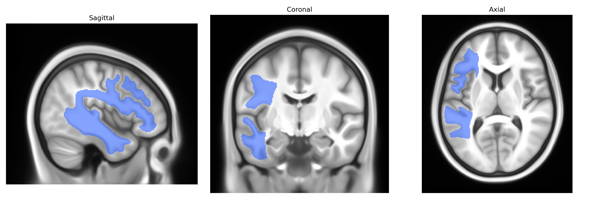
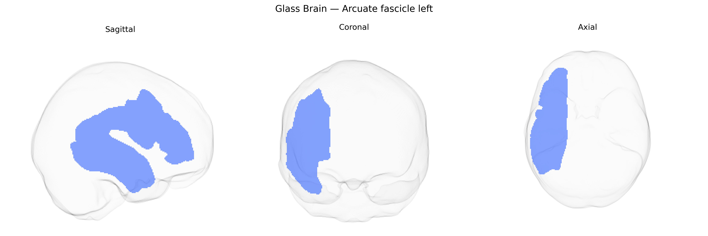

# Arcuate fascicle left

## Overview

The left arcuate fascicle is a major association white matter tract in the left hemisphere that arches around the Sylvian fissure to connect posterior temporal regions with inferior frontal and premotor areas, forming a key component of the language network. It links cortical regions analogous to Wernicke’s area in the posterior superior temporal gyrus and surrounding temporal–parietal junction with Broca’s area in the inferior frontal gyrus, and is critically involved in phonological processing, verbal working memory, repetition, and the integration of auditory and articulatory aspects of speech. Damage or disruption of the left arcuate fascicle has been associated with conduction aphasia and other language deficits, particularly impairments in repetition and phonological output. In the Pandora-TractSeg Atlas, the left arcuate fascicle is delineated as a distinct tract segment within the larger fronto-temporo-parietal association fiber system. There is no direct Wikipedia entry specifically for the “left arcuate fascicle” as an atlas-defined region; a related and encompassing structure is described at: https://en.wikipedia.org/wiki/Arcuate_fasciculus

*Overview generated by GPT-4o (2026).*

---

**Region ID:** 0  
**Hemisphere:** left  
**Atlas:** Pandora-TractSeg 

---

## Arcuate fascicle left – Black Background (Full Brain)

**Full Quality Version:** [Download MP4](full_black.mp4)

---

## Arcuate fascicle left – White Background (Full Brain)

**Full Quality Version:** [Download MP4](full_white.mp4)

---

## Arcuate fascicle left – Black Background (Hemisphere)

**Full Quality Version:** [Download MP4](hemi_black.mp4)

---

## Arcuate fascicle left – White Background (Hemisphere)

**Full Quality Version:** [Download MP4](hemi_white.mp4)

---

## Triplanar View – T1 Background

---

## Triplanar View – Ghost Brain


