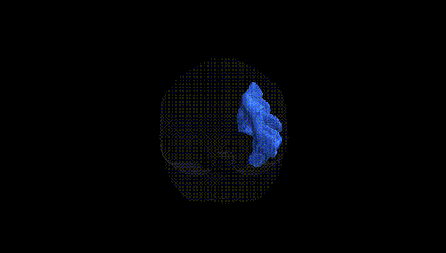
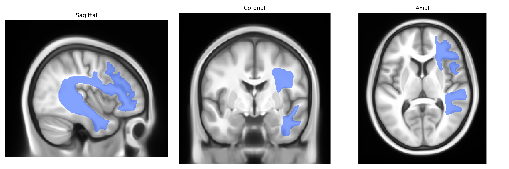
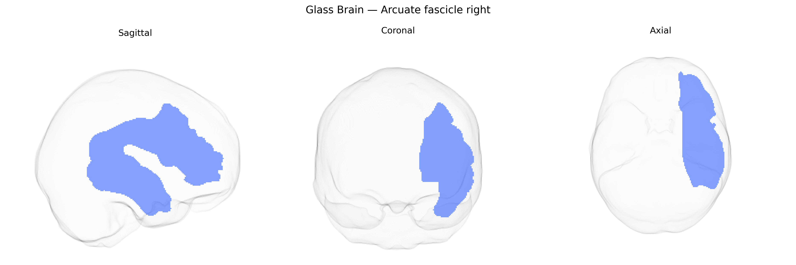

# Arcuate fascicle right

## Overview

The arcuate fascicle (right) is a major associative white matter tract in the human brain that primarily connects posterior temporal regions with frontal language-related areas in the right hemisphere. It is part of the superior longitudinal fasciculus complex and consists of long-range fibers arching around the Sylvian fissure, as well as shorter fronto-parietal and temporo-parietal segments. Structurally, it courses lateral to the corona radiata and internal capsule, linking regions including the superior temporal gyrus, inferior parietal lobule, and inferior frontal gyrus. Functionally, the right arcuate fascicle is implicated in aspects of prosody, spatial attention, and nonverbal communication, in contrast to its left-hemisphere counterpart’s dominant role in language processing. There is no direct Wikipedia article for the right arcuate fascicle; a related entry is [Arcuate fasciculus](https://en.wikipedia.org/wiki/Arcuate_fasciculus).

Current literature provides limited and mostly indirect genetic evidence specifically for the right arcuate fasciculus as defined in the Pandora-TractSeg Atlas, with most findings referring to bilateral or hemispheric arcuate fasciculi or broader fronto‑temporo‑parietal language tracts. Large diffusion MRI GWAS consortia (e.g., ENIGMA-DTI, UK Biobank–based studies) have identified common variants associated with white matter microstructure measures such as fractional anisotropy and mean diffusivity in regions that include or approximate the arcuate fasciculus, implicating genes involved in axon guidance, myelination, and neural development (for example pathways involving ROBO/SLIT, NRG1/ERBB, and oligodendrocyte-related genes), but these are rarely lateralized and not tract-specific to the right arcuate fasciculus. Candidate-gene and smaller imaging‑genetics studies have linked arcuate fasciculus microstructure to language abilities, dyslexia, and speech–language disorders, with reported associations to genes such as FOXP2, KIAA0319, DCDC2, and CNTNAP2, although replication is variable and hemispheric specificity (left vs right) is often inconsistent or unreported. Some psychiatric and neurodevelopmental disorder GWAS (e.g., for schizophrenia, autism, ADHD) show polygenic overlap with global white matter integrity measures, and case–control diffusion studies frequently report alterations in arcuate fasciculus microstructure, but the combination of robust tract-specific GWAS and clear right‑lateralized genetic effects has not yet been firmly established. Overall, while genetic influences on arcuate fasciculus structure and function are supported by converging evidence, precise, replicated, right‑arcuate‑fasciculus–specific genetic associations, particularly in the Pandora-TractSeg framework, remain sparse and should be considered provisional.

*Overview generated by GPT-4o (2026).*

---

**Region ID:** 1  
**Hemisphere:** right  
**Atlas:** Pandora-TractSeg 

---

## Arcuate fascicle right – Black Background (Full Brain)

**Full Quality Version:** <a href="full_black.mp4" download>Download MP4</a>

---

## Arcuate fascicle right – White Background (Full Brain)

**Full Quality Version:** <a href="full_white.mp4" download>Download MP4</a>

---

## Triplanar View – T1 Background

---

## Triplanar View – Ghost Brain


