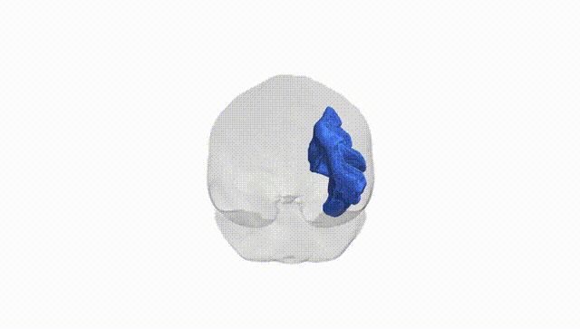

# Arcuate fascicle right

## Overview

The right arcuate fascicle is a major association white matter tract in the right cerebral hemisphere that connects posterior temporal regions with inferior frontal and parietal cortices. It forms part of the superior longitudinal fasciculus complex and courses lateral to the corona radiata and ventricles, arching around the Sylvian fissure. Structurally, it consists of heavily myelinated axons that support rapid long-range cortico-cortical communication. Functionally, while the left arcuate fascicle is more strongly implicated in language processing, the right arcuate fascicle is associated with prosody, pragmatic aspects of communication, and higher-order visuospatial and attentional functions, reflecting hemispheric specialization. There is no direct Wikipedia link specifically for the “right arcuate fascicle”; a related and encompassing entry is: https://en.wikipedia.org/wiki/Arcuate_fasciculus

*Overview generated by GPT-4o (2026).*

---

**Region ID:** 1  
**Hemisphere:** right  
**Atlas:** Pandora-TractSeg 

---

## Arcuate fascicle right – Black Background (Full Brain)

**Full Quality Version:** [Download MP4](full_black.mp4)

---

## Arcuate fascicle right – White Background (Full Brain)

**Full Quality Version:** [Download MP4](full_white.mp4)

---

## Arcuate fascicle right – Black Background (Hemisphere)

**Full Quality Version:** [Download MP4](hemi_black.mp4)

---

## Arcuate fascicle right – White Background (Hemisphere)

**Full Quality Version:** [Download MP4](hemi_white.mp4)

---

## Triplanar View – T1 Background

---

## Triplanar View – Ghost Brain


