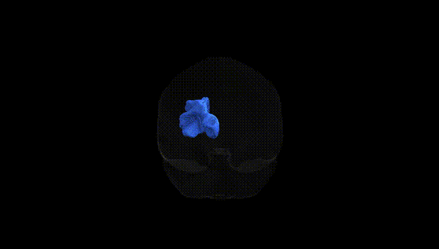
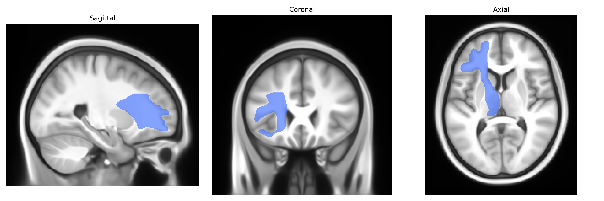

# Anterior Thalamic Radiation left

## Overview

The left Anterior Thalamic Radiation (ATR) is a major white matter tract that connects the anterior and mediodorsal nuclei of the thalamus with the frontal lobe, particularly the prefrontal cortex and anterior cingulate regions. It courses anteriorly from the thalamus through the anterior limb of the internal capsule, contributing to thalamocortical and corticothalamic circuits involved in executive function, attention, working memory, and aspects of emotional regulation. The ATR plays an important role in fronto-thalamic communication and is frequently examined in diffusion MRI studies for its involvement in neuropsychiatric and neurodegenerative conditions, as well as its relevance to cognitive outcome after brain injury. There is no direct Wikipedia article for the Anterior Thalamic Radiation; a related structure with more general information is the [Thalamic radiation](https://en.wikipedia.org/wiki/Thalamic_radiation).

As of 2024, there are no well-replicated, tract-specific genetic association findings reported explicitly for the left anterior thalamic radiation (ATR) as defined in the Pandora-TractSeg Atlas, and most evidence comes from broader studies of fronto-thalamic or anterior thalamic radiations in general or from large GWAS of diffusion MRI metrics that aggregate across hemispheres or related tracts. Polygenic influences on ATR microstructure are supported indirectly by large imaging-genetics consortia (e.g., ENIGMA, UK Biobank analyses), which have identified genome-wide significant loci affecting diffusion measures such as fractional anisotropy (FA) and mean diffusivity (MD) in anterior thalamic or fronto‑thalamic pathways, often involving genes related to axonal growth, myelination, and neurodevelopment (for example, variants near genes such as BDNF, NTRK1/2, MAL, or oligodendrocyte- and cytoskeleton-related loci, although not consistently or specifically assigned to the left ATR). Altered ATR microstructure (reduced FA, increased MD) has been associated phenotypically with major depressive disorder, bipolar disorder, schizophrenia, obsessive‑compulsive disorder, ADHD, and cognitive traits (executive function, processing speed), as well as with vascular risk and late‑life depression, but explicit GWAS linking genetic variants, ATR‑specific diffusion measures, and these disorders in a three-way manner remain sparse. Overall, current genetic evidence supports a heritable basis for microstructural variability in thalamo‑frontal tracts that include the ATR, yet detailed, hemisphere- and atlas-specific GWAS findings for the left ATR from Pandora‑TractSeg are not available or are not clearly distinguished in the published literature.

*Overview generated by GPT-4o (2026).*

---

**Region ID:** 2  
**Hemisphere:** left  
**Atlas:** Pandora-TractSeg 

---

## Anterior Thalamic Radiation left – Black Background (Full Brain)

**Full Quality Version:** <a href="full_black.mp4" download>Download MP4</a>

---

## Anterior Thalamic Radiation left – White Background (Full Brain)

**Full Quality Version:** <a href="full_white.mp4" download>Download MP4</a>

---

## Triplanar View – T1 Background

---

## Triplanar View – Ghost Brain


