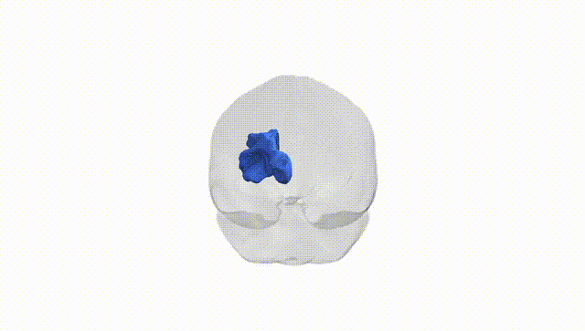
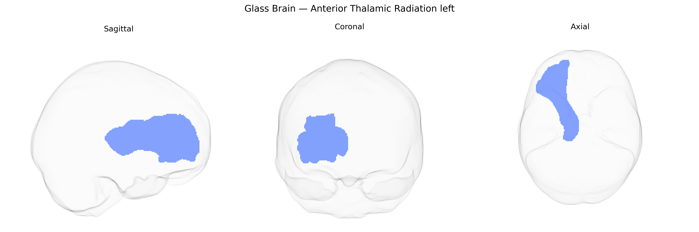

# Anterior Thalamic Radiation left

## Overview

The left anterior thalamic radiation (ATR) is a major white matter tract that connects the anterior and mediodorsal nuclei of the thalamus with the prefrontal cortex, particularly regions of the dorsolateral and medial prefrontal areas in the left hemisphere. Running anteriorly through the anterior limb of the internal capsule, it participates in thalamo-cortical circuits involved in higher-order cognitive functions, including executive processes, attention, and aspects of emotion and motivation. The ATR forms part of fronto-thalamic loops that integrate subcortical and cortical information, and alterations in its microstructure have been implicated in a range of neuropsychiatric and neurodegenerative conditions. There is no direct Wikipedia link for the left anterior thalamic radiation as a separate atlas-defined entity; a closely related and encompassing structure is the anterior thalamic radiation entry: https://en.wikipedia.org/wiki/Anterior_thalamic_radiations

*Overview generated by GPT-4o (2026).*

---

**Region ID:** 2  
**Hemisphere:** left  
**Atlas:** Pandora-TractSeg 

---

## Anterior Thalamic Radiation left – Black Background (Full Brain)

**Full Quality Version:** [Download MP4](full_black.mp4)

---

## Anterior Thalamic Radiation left – White Background (Full Brain)

**Full Quality Version:** [Download MP4](full_white.mp4)

---

## Anterior Thalamic Radiation left – Black Background (Hemisphere)

**Full Quality Version:** [Download MP4](hemi_black.mp4)

---

## Anterior Thalamic Radiation left – White Background (Hemisphere)

**Full Quality Version:** [Download MP4](hemi_white.mp4)

---

## Triplanar View – T1 Background

---

## Triplanar View – Ghost Brain


