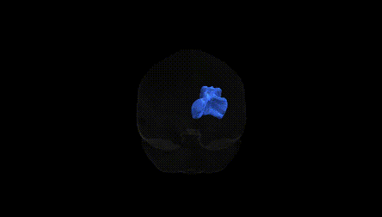
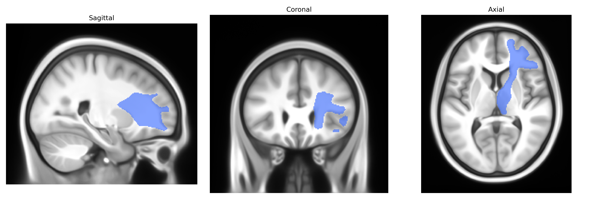
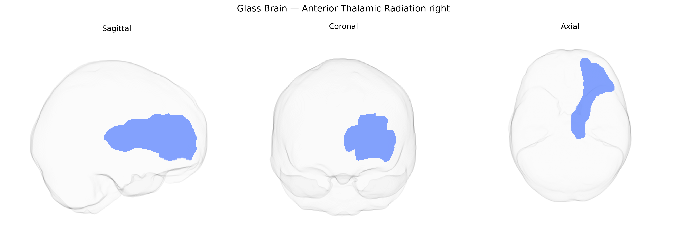

# Anterior Thalamic Radiation right

## Overview

The right Anterior Thalamic Radiation (ATR) is a major white matter projection pathway connecting the anterior and mediodorsal nuclei of the thalamus with the prefrontal cortex, particularly the dorsolateral and medial prefrontal regions, via the anterior limb of the internal capsule. It plays a key role in higher-order cognitive functions, including executive control, working memory, and aspects of emotional regulation, by relaying and integrating thalamocortical and corticothalamic signals. The ATR is frequently studied in diffusion MRI and tractography—for example, in the Pandora-TractSeg Atlas—because of its involvement in neuropsychiatric and neurodegenerative disorders, as well as in outcome prediction after brain injury or neurosurgical interventions. There is no direct Wikipedia article for the Anterior Thalamic Radiation; a related structure is the [Internal capsule](https://en.wikipedia.org/wiki/Internal_capsule).

As of 2024, there are no genetic association studies explicitly focused on the Anterior Thalamic Radiation (ATR) right tract as defined in the Pandora‑TractSeg Atlas, and genetic findings generally refer to the ATR bilaterally or as part of broader fronto‑thalamic or anterior limb of internal capsule pathways rather than this specific atlas parcel. Large diffusion MRI GWAS consortia (e.g., ENIGMA, UK Biobank–based studies) have reported polygenic influences on white matter microstructure indices such as fractional anisotropy (FA) and mean diffusivity (MD) in tracts that include or overlap the ATR, implicating genes involved in neurodevelopment, axon guidance, and myelination (for example loci near genes such as CNTN4, NCAM1, and MAG in some studies), but these are not consistently or uniquely attributed to the right ATR. Genetically influenced variation in ATR‑related diffusion measures has been linked, at a global or regional level, to traits such as cognitive performance, educational attainment, schizophrenia, major depressive disorder, and attention‑deficit/hyperactivity disorder, as well as to general brain aging and dementia risk, yet these associations are typically reported at the level of composite fronto‑striatal or thalamo‑cortical tracts or whole‑brain diffusion factors. Overall, current evidence indicates that ATR microstructure is heritable and participates in polygenic architectures underlying cognition and psychiatric disease, but specific, replicated gene–tract associations for the right ATR segment as defined by Pandora‑TractSeg are limited and not well characterized in the literature.

*Overview generated by GPT-4o (2026).*

---

**Region ID:** 3  
**Hemisphere:** right  
**Atlas:** Pandora-TractSeg 

---

## Anterior Thalamic Radiation right – Black Background (Full Brain)

**Full Quality Version:** <a href="full_black.mp4" download>Download MP4</a>

---

## Anterior Thalamic Radiation right – White Background (Full Brain)

**Full Quality Version:** <a href="full_white.mp4" download>Download MP4</a>

---

## Triplanar View – T1 Background

---

## Triplanar View – Ghost Brain


