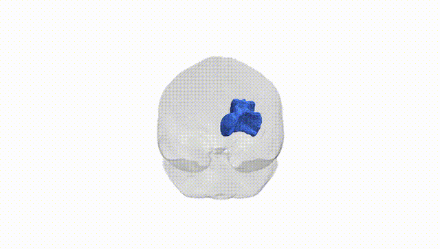

# Anterior Thalamic Radiation right

## Overview

The right anterior thalamic radiation is a major white matter tract connecting the anterior and mediodorsal nuclei of the right thalamus with the prefrontal cortex, anterior cingulate cortex, and parts of the frontal lobe. It courses anterolaterally from the thalamus through the anterior limb of the internal capsule, contributing to circuits involved in executive function, attention, working memory, and emotional regulation as part of thalamocortical and fronto-thalamic loops. Functionally, it is implicated in higher-order cognitive processing and affective modulation, and structural or microstructural alterations in this tract have been associated with neuropsychiatric and neurodegenerative conditions. The Pandora-TractSeg atlas labels this tract specifically by hemisphere, but there is no direct Wikipedia page for the “right anterior thalamic radiation”; a related page describing the broader structure is: https://en.wikipedia.org/wiki/Thalamic_radiation

*Overview generated by GPT-4o (2026).*

---

**Region ID:** 3  
**Hemisphere:** right  
**Atlas:** Pandora-TractSeg 

---

## Anterior Thalamic Radiation right – Black Background (Full Brain)

**Full Quality Version:** [Download MP4](full_black.mp4)

---

## Anterior Thalamic Radiation right – White Background (Full Brain)

**Full Quality Version:** [Download MP4](full_white.mp4)

---

## Anterior Thalamic Radiation right – Black Background (Hemisphere)

**Full Quality Version:** [Download MP4](hemi_black.mp4)

---

## Anterior Thalamic Radiation right – White Background (Hemisphere)

**Full Quality Version:** [Download MP4](hemi_white.mp4)

---

## Triplanar View – T1 Background

---

## Triplanar View – Ghost Brain


