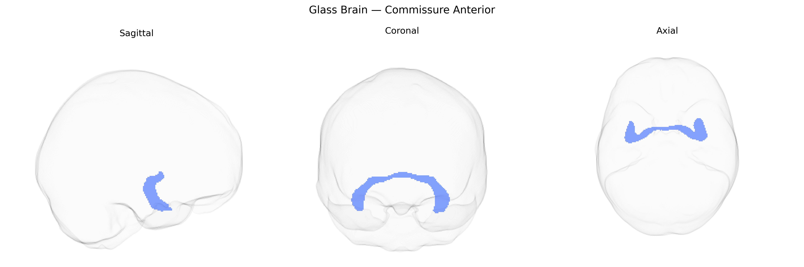

# Commissure Anterior

## Overview

The Commissure Anterior is a compact white matter fiber bundle that crosses the midline of the brain anterior to the third ventricle, forming a key interhemispheric commissural pathway. It connects regions of the temporal lobes, particularly the anterior temporal cortices and olfactory structures, and contributes to interhemispheric transfer of information related to olfaction, emotion, and aspects of memory. Structurally, it is divided into anterior and posterior bundles, with the anterior portion primarily linking olfactory regions and the posterior portion connecting temporal neocortical areas. In diffusion MRI–based atlases such as the Pandora-TractSeg Atlas, the Commissure Anterior is delineated as a discrete tract that provides an alternative route for hemispheric communication, especially in cases where the corpus callosum is absent or compromised. There is no direct Wikipedia article for “Commissure Anterior”; a closely related entry is [Anterior commissure](https://en.wikipedia.org/wiki/Anterior_commissure).

Current genetic association data specific to the Commissure Anterior white matter tract, as defined in the Pandora-TractSeg Atlas, are sparse and largely indirect. Large diffusion MRI GWAS such as those from the UK Biobank and ENIGMA consortia have identified numerous loci influencing global and regional white matter microstructure (including fractional anisotropy and mean diffusivity) in commissural pathways, highlighting genes involved in axon guidance, myelination, and neurodevelopment (e.g., variants near genes such as BDNF, NCAM1, and those in oligodendrocyte-related pathways), but these are typically reported for composite measures (e.g., “commissural fibers,” “callosal tracts,” or whole-brain skeleton) rather than the anterior commissure specifically. Some imaging‑genetics studies and clinical diffusion MRI work have implicated anterior commissure abnormalities in disorders such as schizophrenia, temporal lobe epilepsy, and autism spectrum conditions, which themselves show robust polygenic architectures, but direct tract-specific GWAS linking particular variants to diffusion metrics confined to the anterior commissure have not yet been clearly established or widely reported. Overall, existing evidence suggests that the anterior commissure likely shares genetic determinants with other midline and association white matter pathways, but concrete, tract-resolved genetic associations for the Commissure Anterior in the Pandora-TractSeg Atlas remain poorly characterized in the current literature.

*Overview generated by GPT-4o (2026).*

---

**Region ID:** 4  
**Hemisphere:** bilateral  
**Atlas:** Pandora-TractSeg 

---

## Commissure Anterior – Black Background (Full Brain)

**Full Quality Version:** <a href="full_black.mp4" download>Download MP4</a>

---

## Commissure Anterior – White Background (Full Brain)

**Full Quality Version:** <a href="full_white.mp4" download>Download MP4</a>

---

## Triplanar View – T1 Background

---

## Triplanar View – Ghost Brain


