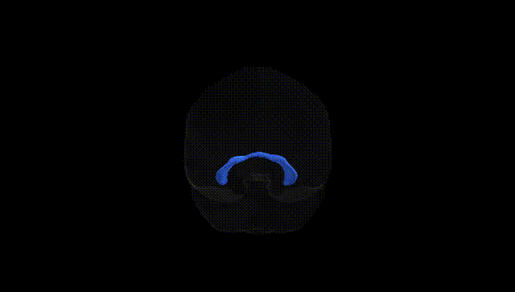
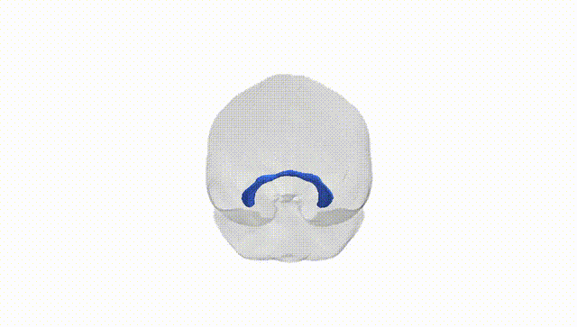
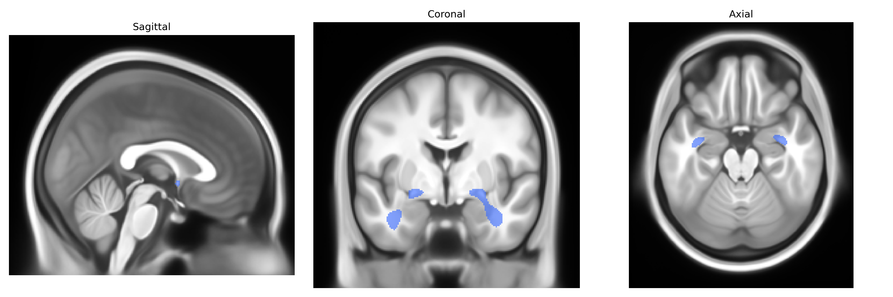

# Commissure Anterior

## Overview

The bilateral anterior commissure is a compact, transverse white matter fiber bundle that crosses the midline of the brain ventral to the columns of the fornix and rostral to the third ventricle, interconnecting homologous regions of the two cerebral hemispheres. It is composed mainly of myelinated axons linking parts of the temporal lobes, including olfactory and amygdalar regions, and contributes to interhemispheric transfer of sensory and limbic information, particularly in pathways related to olfaction, emotional processing, and aspects of pain perception. In diffusion MRI–based atlases such as the Pandora-TractSeg Atlas, the bilateral anterior commissure is segmented as a distinct tract bridging left and right temporal/limbic structures across the midline. There is no direct Wikipedia page specifically for the “bilateral Commissure Anterior” as defined in the Pandora-TractSeg Atlas; a closely related and encompassing structure is the anterior commissure: https://en.wikipedia.org/wiki/Anterior_commissure.

*Overview generated by GPT-4o (2026).*

---

**Region ID:** 4  
**Hemisphere:** bilateral  
**Atlas:** Pandora-TractSeg 

---

## Commissure Anterior – Black Background (Full Brain)

**Full Quality Version:** [Download MP4](full_black.mp4)

---

## Commissure Anterior – White Background (Full Brain)

**Full Quality Version:** [Download MP4](full_white.mp4)

---

## Triplanar View – T1 Background

---

## Triplanar View – Ghost Brain


