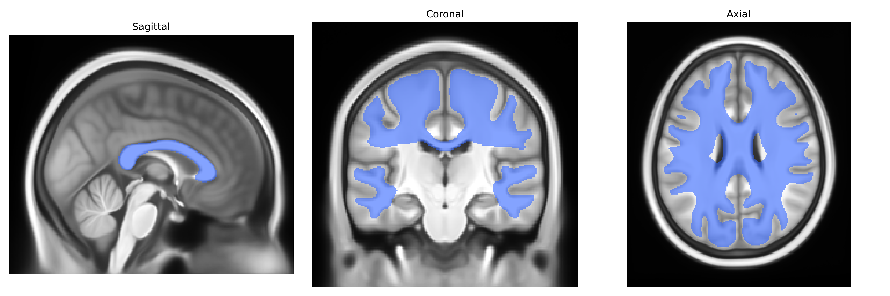

# Corpus Callosum - all

## Overview

The Corpus Callosum is the largest commissural white matter structure in the human brain, consisting of heavily myelinated axons that interconnect homologous and heterologous regions of the left and right cerebral hemispheres to facilitate interhemispheric integration of sensory, motor, and higher-order cognitive information. Anatomically, it is a C-shaped midline structure that can be subdivided into rostrum, genu, body (truncus), isthmus, and splenium, each segment preferentially connecting distinct cortical territories such as prefrontal, premotor, primary motor, somatosensory, parietal, temporal, and occipital cortices. Developmentally, the Corpus Callosum forms through guided midline crossing of callosal axons during gestation, and abnormalities in its formation (e.g., agenesis, hypoplasia, dysgenesis) are associated with a spectrum of neurodevelopmental and neuropsychiatric conditions. Microstructurally, it exhibits regional variations in fiber diameter, density, and myelination, which contribute to differences in conduction velocity and functional specialization across its segments. Functionally, it supports bilateral coordination of movement, integration of perceptual information, language processing, and higher cognitive operations, and is a key substrate for functional lateralization and hemispheric dominance. [Corpus Callosum](https://en.wikipedia.org/wiki/Corpus_callosum)

Current genetic knowledge specific to the Corpus Callosum – all white matter tract as defined in the Pandora-TractSeg atlas is largely indirect, extrapolated from broader studies of corpus callosum microstructure and global callosal fiber measures rather than that exact tract label. Diffusion MRI GWAS of fractional anisotropy, mean diffusivity, and related metrics in callosal regions have repeatedly implicated genes involved in axon guidance, myelination, and neurodevelopment, including loci near or within CNTN4, NRG1, LINGO1, NFASC, and genes in the EPHA/EPHB receptor family, as well as oligodendrocyte- and myelin-related genes such as MAG and MBP in some analyses; polygenic architecture overlaps with general cognitive ability, educational attainment, and schizophrenia risk. Callosal integrity measures (often subdivided into genu, body, and splenium rather than an “all callosal fibers” tract) show genetic correlations with attention-deficit/hyperactivity disorder, autism spectrum disorder, major depression, bipolar disorder, and multiple sclerosis, consistent with known callosal abnormalities in these conditions, though specific risk loci are rarely interpreted as acting exclusively through this tract. Twin and family studies demonstrate high heritability of callosal diffusion metrics and mid-sagittal area, but most GWAS report multi-tract or whole-brain white matter findings, with the corpus callosum contributing to shared factors rather than yielding tract-unique loci. As of current literature, no large-scale GWAS has targeted the Pandora-TractSeg “Corpus Callosum – all” tract as a distinct phenotype, and there is little tract-specific evidence beyond its participation in the general genetic architecture of callosal and global white matter microstructure.

*Overview generated by GPT-4o (2026).*

---

**Region ID:** 12  
**Hemisphere:** bilateral  
**Atlas:** Pandora-TractSeg 

---

## Corpus Callosum - all – Black Background (Full Brain)

**Full Quality Version:** <a href="full_black.mp4" download>Download MP4</a>

---

## Corpus Callosum - all – White Background (Full Brain)

**Full Quality Version:** <a href="full_white.mp4" download>Download MP4</a>

---

## Triplanar View – T1 Background

---

## Triplanar View – Ghost Brain


