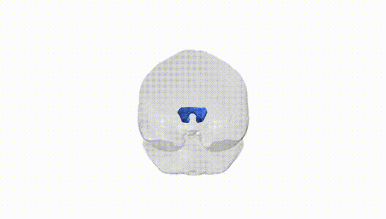

# Rostrum

## Overview

The rostrum is the thin, ventral part of the corpus callosum that extends anteriorly and inferiorly from the genu, curving beneath the rostral frontal lobes toward the lamina terminalis. It is composed of densely myelinated commissural fibers that interconnect ventromedial and orbital regions of the prefrontal cortex between the two cerebral hemispheres, contributing to bilateral integration of higher-order cognitive, emotional, and executive functions. The rostrum lies superior to the optic chiasm and anterior commissure, and is continuous posteriorly with the genu, forming part of the major interhemispheric white matter bridge of the telencephalon. There is no direct link for the rostrum alone; see the related structure [Corpus callosum](https://en.wikipedia.org/wiki/Corpus_callosum).

Current literature provides very limited tract-specific genetic information on the rostrum of the corpus callosum as defined in the Pandora–TractSeg atlas. Large diffusion MRI GWAS and imaging–genetics consortia (e.g., ENIGMA, UK Biobank–based studies) have identified numerous loci influencing global or regional callosal microstructure (often in the genu, body, and splenium) and have linked diffusion metrics such as fractional anisotropy and mean diffusivity in callosal regions to polygenic architectures shared with cognitive performance, educational attainment, schizophrenia, bipolar disorder, major depression, ADHD, autism spectrum disorder, and neurodegenerative conditions. However, these studies typically analyze the corpus callosum as broader subregions (e.g., “anterior,” “genu,” or “forceps minor”) rather than isolating the rostrum tract per the Pandora–TractSeg parcellation. As a result, no robust, replicated GWAS hits or trait associations have been reported specifically and uniquely for the rostrum tract, and current knowledge must be inferred from more general findings on anterior callosal and frontal interhemispheric white matter rather than from direct genetic evidence for the rostrum itself.

*Overview generated by GPT-4o (2026).*

---

**Region ID:** 5  
**Hemisphere:** bilateral  
**Atlas:** Pandora-TractSeg 

---

## Rostrum – Black Background (Full Brain)

**Full Quality Version:** <a href="full_black.mp4" download>Download MP4</a>

---

## Rostrum – White Background (Full Brain)

**Full Quality Version:** <a href="full_white.mp4" download>Download MP4</a>

---

## Triplanar View – T1 Background

---

## Triplanar View – Ghost Brain


