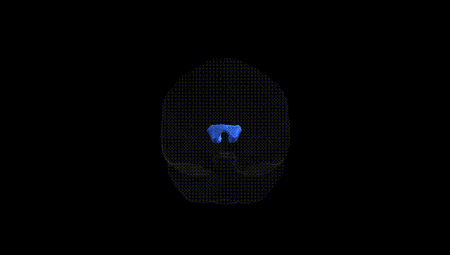
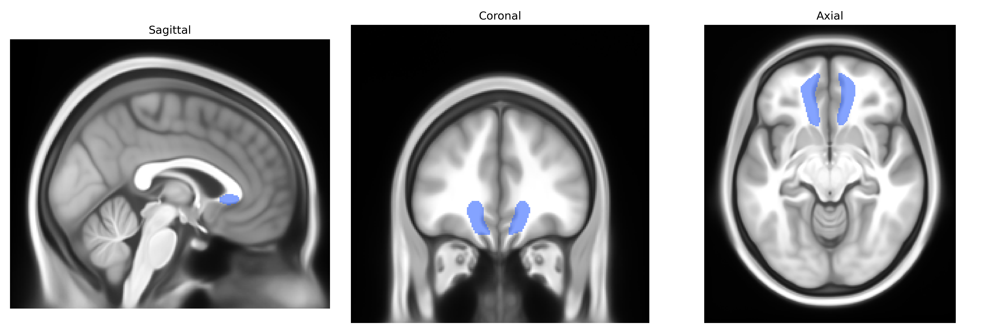
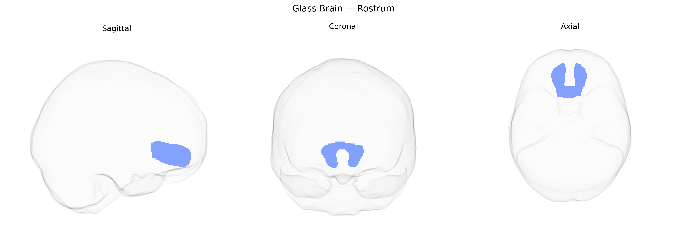

# Rostrum

## Overview

The bilateral rostrum in the Pandora-TractSeg Atlas refers to the rostral (anterior) segment of the corpus callosum, a major commissural white matter bundle connecting homologous cortical regions of the two cerebral hemispheres. Situated ventrally and anteriorly relative to the genu, the rostrum curves posteriorly beneath the rostral portion of the septum pellucidum and the lamina terminalis, linking regions of the orbitofrontal and ventromedial prefrontal cortices. Its myelinated fibers contribute to interhemispheric integration of high-order cognitive and affective processes associated with frontal lobe function, including aspects of decision-making, emotional regulation, and social cognition. Damage or developmental abnormalities in this segment of the corpus callosum have been implicated in a range of neurodevelopmental and neuropsychiatric conditions, as well as in disconnection syndromes affecting frontal lobe networks. There is no direct Wikipedia link specifically for “bilateral rostrum” as defined in the Pandora-TractSeg Atlas; a closely related structure is the corpus callosum: https://en.wikipedia.org/wiki/Corpus_callosum.

*Overview generated by GPT-4o (2026).*

---

**Region ID:** 5  
**Hemisphere:** bilateral  
**Atlas:** Pandora-TractSeg 

---

## Rostrum – Black Background (Full Brain)

**Full Quality Version:** [Download MP4](full_black.mp4)

---

## Rostrum – White Background (Full Brain)

**Full Quality Version:** [Download MP4](full_white.mp4)

---

## Triplanar View – T1 Background

---

## Triplanar View – Ghost Brain


