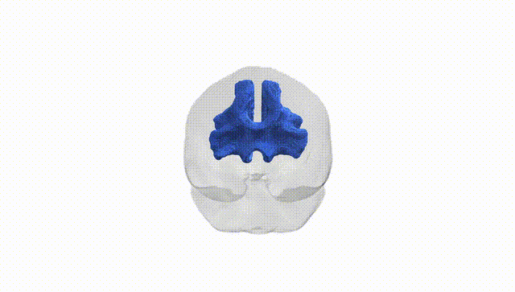

# Genu

## Overview

The genu is the anterior bend of the corpus callosum, a major commissural white matter structure that interconnects homologous regions of the medial and lateral prefrontal cortices across the two cerebral hemispheres. Composed of densely packed, heavily myelinated callosal fibers, the genu plays a critical role in interhemispheric integration of higher-order cognitive, affective, and executive functions. Its fibers curve anteriorly and then project laterally and posteriorly into the frontal lobes, forming the forceps minor. Structural alterations of the genu have been associated with a range of neuropsychiatric and neurodegenerative conditions, including schizophrenia, major depressive disorder, traumatic brain injury, and multiple sclerosis, often reflected in changes in diffusion MRI metrics such as fractional anisotropy and mean diffusivity. There is no direct Wikipedia article for the genu alone; see the related structure [Corpus callosum](https://en.wikipedia.org/wiki/Corpus_callosum).

The genu of the corpus callosum, as delineated in the Pandora-TractSeg Atlas, has been implicated in multiple genetic and GWAS findings, but evidence is still relatively sparse and largely indirect. Twin and family studies indicate high heritability for diffusion MRI measures such as fractional anisotropy (FA) and mean diffusivity (MD) in the genu, with several large-scale imaging genetics consortia (e.g., ENIGMA, UK Biobank–based studies) reporting genome-wide significant loci that influence FA/MD in callosal regions including the genu, though many signals are shared across broader callosal or global white matter measures rather than being genu-specific. Reported associations include common variants near or within genes related to axon guidance, myelination, and neurodevelopment (for example, genes involved in oligodendrocyte function and cytoskeletal organization), and polygenic scores for cognitive performance, educational attainment, and schizophrenia have been associated with microstructural variation in the genu and adjacent callosal segments. Altered genu FA/MD has been repeatedly observed in schizophrenia, bipolar disorder, major depressive disorder, autism spectrum disorder, and attention-deficit/hyperactivity disorder, but genetic studies typically link risk variants to these disorders and to global or callosal white matter metrics rather than uniquely to genu-specific tracts. Overall, the genu is clearly under genetic influence and participates in genetically mediated brain–behavior relationships, yet tract-specific genetic associations—especially explicitly tied to the Pandora-TractSeg genu label—remain limited, with most evidence derived from broader corpus callosum or whole-brain white matter GWAS.

*Overview generated by GPT-4o (2026).*

---

**Region ID:** 6  
**Hemisphere:** bilateral  
**Atlas:** Pandora-TractSeg 

---

## Genu – Black Background (Full Brain)

**Full Quality Version:** <a href="full_black.mp4" download>Download MP4</a>

---

## Genu – White Background (Full Brain)

**Full Quality Version:** <a href="full_white.mp4" download>Download MP4</a>

---

## Triplanar View – T1 Background

---

## Triplanar View – Ghost Brain


