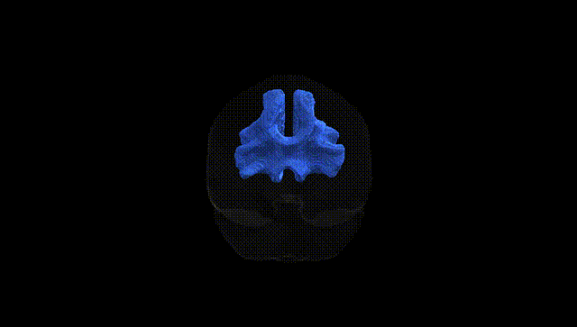
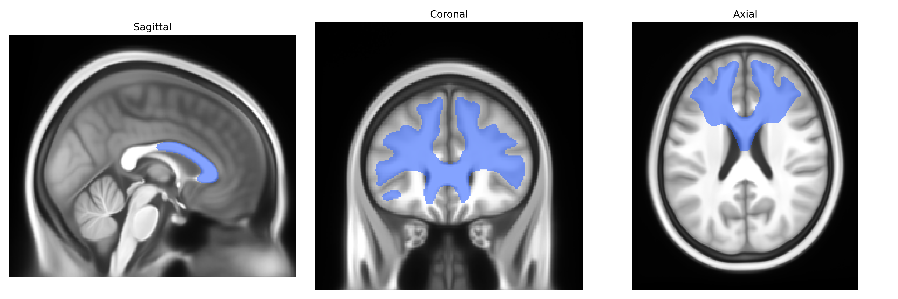
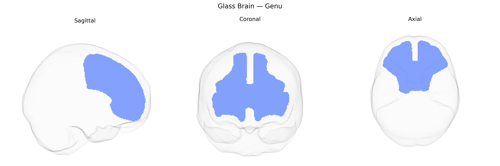

# Genu

## Overview

The bilateral genu region in the Pandora-TractSeg atlas refers to the anterior bend (“knee”) of the corpus callosum, comprising interhemispheric fibers that primarily connect prefrontal cortical areas of both hemispheres. Anatomically, the genu lies rostral to the body of the corpus callosum, curving anteriorly before extending laterally into the frontal lobes via the forceps minor. Functionally, this region supports higher-order cognitive processes such as executive function, working memory, attention, and aspects of social cognition by integrating information between homologous frontal regions. Microstructural integrity of the genu, often assessed with diffusion MRI, is sensitive to neurodevelopmental and neurodegenerative processes, including aging, traumatic brain injury, and disorders such as schizophrenia and multiple sclerosis. There is no direct Wikipedia page for “bilateral genu” as a tractography-defined region, but the closely related structure is the genu of the corpus callosum: https://en.wikipedia.org/wiki/Corpus_callosum.

*Overview generated by GPT-4o (2026).*

---

**Region ID:** 6  
**Hemisphere:** bilateral  
**Atlas:** Pandora-TractSeg 

---

## Genu – Black Background (Full Brain)

**Full Quality Version:** [Download MP4](full_black.mp4)

---

## Genu – White Background (Full Brain)

**Full Quality Version:** [Download MP4](full_white.mp4)

---

## Triplanar View – T1 Background

---

## Triplanar View – Ghost Brain


