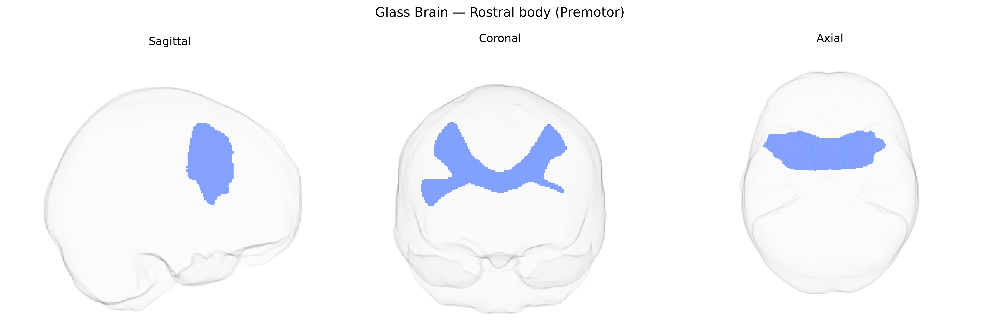

# Rostral body (Premotor)

## Overview

The Rostral body (Premotor) in the Pandora-TractSeg Atlas refers to white matter associated with the premotor subdivisions of the frontal lobe, situated anterior to the primary motor cortex and involved in higher-order aspects of motor planning, action selection, and sensorimotor integration. This region supports the transformation of sensory information into motor programs, contributing to the preparation and sequencing of movements and to the integration of external cues (e.g., visual or somatosensory) into motor behavior. Its fibers interconnect premotor cortices with primary motor areas, supplementary motor regions, parietal association cortices, and subcortical motor structures, forming part of distributed networks underlying complex, goal-directed actions. There is no direct link for this specific tract; a related structure is the [Premotor cortex](https://en.wikipedia.org/wiki/Premotor_cortex).

As of current literature, there are no well-established, tract-specific genetic association findings reported uniquely for the Rostral body (Premotor) white matter tract as defined in the Pandora-TractSeg Atlas. Most diffusion MRI GWAS that examine measures such as fractional anisotropy or mean diffusivity either analyze global or lobar white matter properties, large composite tracts (e.g., corticospinal tract, superior longitudinal fasciculus, corpus callosum subdivisions), or atlas-specific bundles that do not map one-to-one onto the “Rostral body (Premotor)” label. Large-scale imaging genetics studies (e.g., UK Biobank–based GWAS) have identified numerous loci and genes influencing microstructural variation in motor- and premotor-related white matter—often implicating neurodevelopmental, myelination, and axon-guidance pathways—and have linked these measures to traits such as general cognitive function, neuropsychiatric disorders, and motor performance, but these results are not typically resolved down to this specific tract segment. Consequently, while it is highly plausible that the Rostral body (Premotor) tract shares genetic influences with other premotor and callosal/motor pathways, direct, tract-specific genetic associations or disorder links for this precise Pandora-TractSeg tract are not yet clearly documented in the published GWAS or imaging-genetics literature.

*Overview generated by GPT-4o (2026).*

---

**Region ID:** 7  
**Hemisphere:** bilateral  
**Atlas:** Pandora-TractSeg 

---

## Rostral body (Premotor) – Black Background (Full Brain)

**Full Quality Version:** <a href="full_black.mp4" download>Download MP4</a>

---

## Rostral body (Premotor) – White Background (Full Brain)

**Full Quality Version:** <a href="full_white.mp4" download>Download MP4</a>

---

## Triplanar View – T1 Background

---

## Triplanar View – Ghost Brain


