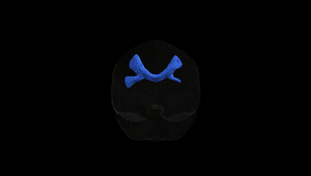
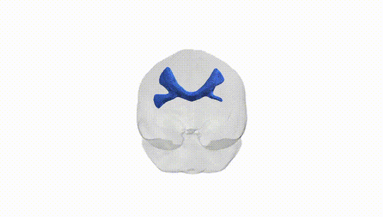
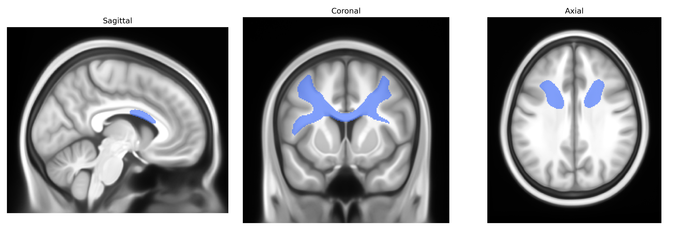

# Rostral body (Premotor)

## Overview

The bilateral rostral body (premotor) region, as defined in the Pandora-TractSeg atlas, corresponds to the rostral portion of the premotor cortex located anterior to the primary motor cortex on the lateral surface of the frontal lobe in both hemispheres. This area is involved in higher-order motor control, including the planning, selection, and sequencing of voluntary movements, integration of sensory information to guide motor actions, and coordination of movements across multiple joints and effectors. It receives input from parietal and prefrontal regions and projects to primary motor cortex and brainstem/spinal motor pathways, thus acting as a key interface between cognitive processes and motor execution. There is no direct Wikipedia page for “bilateral rostral body (premotor)” or the Pandora-TractSeg label, but a closely related structure is the premotor cortex: https://en.wikipedia.org/wiki/Premotor_cortex

*Overview generated by GPT-4o (2026).*

---

**Region ID:** 7  
**Hemisphere:** bilateral  
**Atlas:** Pandora-TractSeg 

---

## Rostral body (Premotor) – Black Background (Full Brain)

**Full Quality Version:** [Download MP4](full_black.mp4)

---

## Rostral body (Premotor) – White Background (Full Brain)

**Full Quality Version:** [Download MP4](full_white.mp4)

---

## Triplanar View – T1 Background

---

## Triplanar View – Ghost Brain


