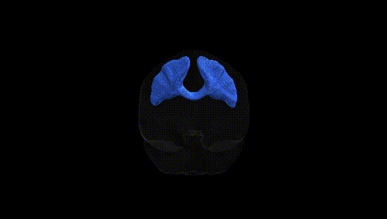
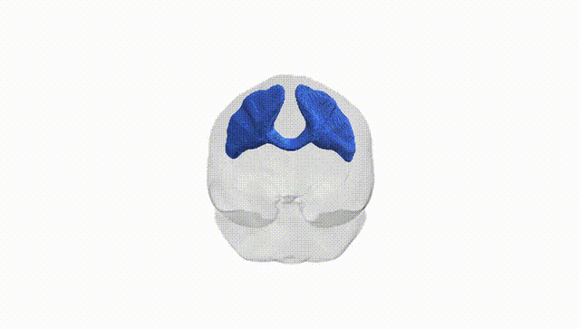
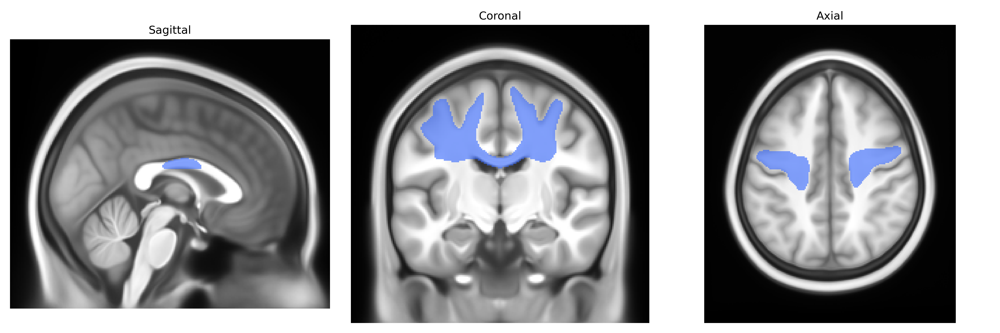
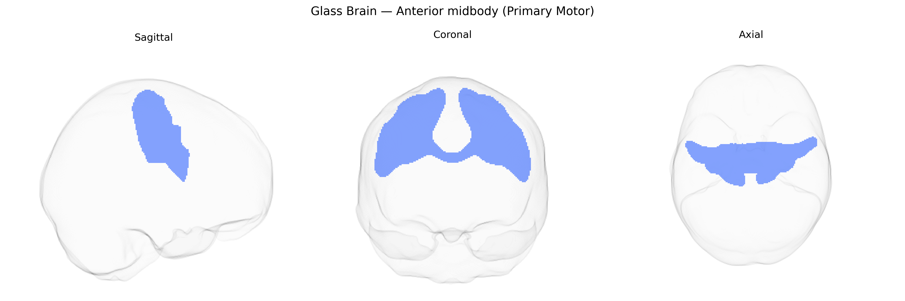

# Anterior midbody (Primary Motor)

## Overview

The bilateral anterior midbody (Primary Motor) region in the Pandora-TractSeg atlas corresponds to a central portion of the primary motor cortex (M1) located in the precentral gyrus, anterior to the central sulcus and organized somatotopically along the motor homunculus. This midbody sector is primarily associated with motor control of the upper limb and trunk musculature, receiving inputs from premotor and somatosensory areas and projecting via corticospinal and corticobulbar tracts to spinal and brainstem motor nuclei. Neuronal populations in this region are predominantly pyramidal cells in layer V, including Betz cells, which contribute to fine voluntary movement control, especially of distal musculature. Functionally, the anterior midbody participates in planning and executing precise, goal-directed movements and integrates sensory feedback to adjust motor output. There is no direct Wikipedia page for the “anterior midbody (Primary Motor)” as defined in the Pandora-TractSeg atlas; a closely related structure is the primary motor cortex: https://en.wikipedia.org/wiki/Primary_motor_cortex

*Overview generated by GPT-4o (2026).*

---

**Region ID:** 8  
**Hemisphere:** bilateral  
**Atlas:** Pandora-TractSeg 

---

## Anterior midbody (Primary Motor) – Black Background (Full Brain)

**Full Quality Version:** [Download MP4](full_black.mp4)

---

## Anterior midbody (Primary Motor) – White Background (Full Brain)

**Full Quality Version:** [Download MP4](full_white.mp4)

---

## Triplanar View – T1 Background

---

## Triplanar View – Ghost Brain


