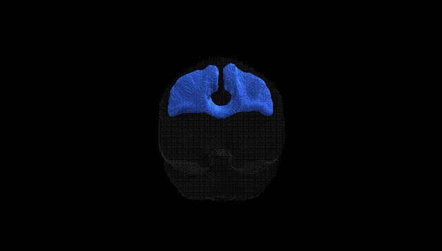
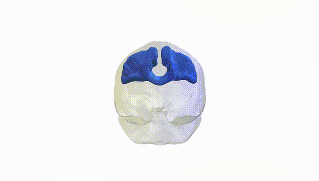
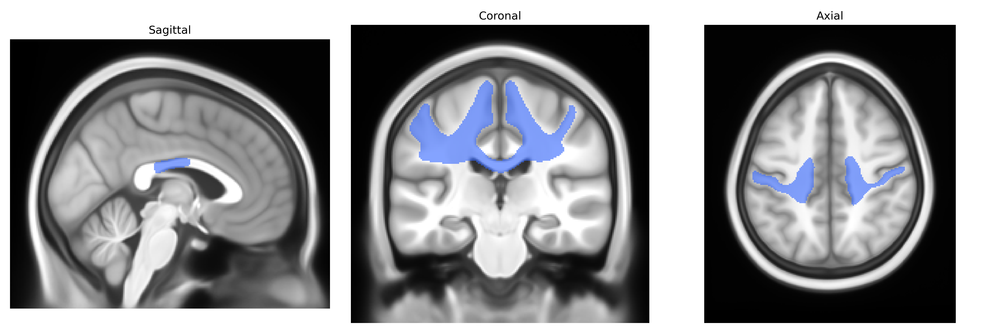
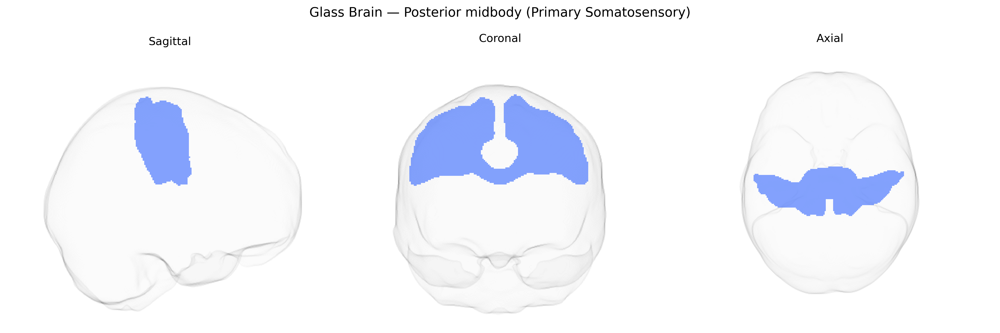

# Posterior midbody (Primary Somatosensory)

## Overview

The bilateral posterior midbody (primary somatosensory) region corresponds to a central segment of the postcentral gyrus within the primary somatosensory cortex (S1), situated posterior to the central sulcus and organized somatotopically to represent mainly trunk, proximal limb, and parts of the upper extremity. This region receives dense thalamocortical input from the ventral posterior nucleus of the thalamus and contributes to the processing of tactile, proprioceptive, and nociceptive information, integrating signals from cutaneous and deep mechanoreceptors to support body perception, position sense, and sensorimotor integration. Cytoarchitectonically, it largely overlaps with Brodmann areas 1–3, characterized by a prominent granular layer IV and columnar organization that underlies modality-specific and somatotopic segregation of sensory processing, while its bilateral organization supports coordinated perception and comparison of somatosensory inputs across both sides of the body. There is no direct Wikipedia link for the “posterior midbody” region as defined in the Pandora-TractSeg Atlas; a closely related and encompassing structure is the primary somatosensory cortex: https://en.wikipedia.org/wiki/Primary_somatosensory_cortex

*Overview generated by GPT-4o (2026).*

---

**Region ID:** 9  
**Hemisphere:** bilateral  
**Atlas:** Pandora-TractSeg 

---

## Posterior midbody (Primary Somatosensory) – Black Background (Full Brain)

**Full Quality Version:** [Download MP4](full_black.mp4)

---

## Posterior midbody (Primary Somatosensory) – White Background (Full Brain)

**Full Quality Version:** [Download MP4](full_white.mp4)

---

## Triplanar View – T1 Background

---

## Triplanar View – Ghost Brain


