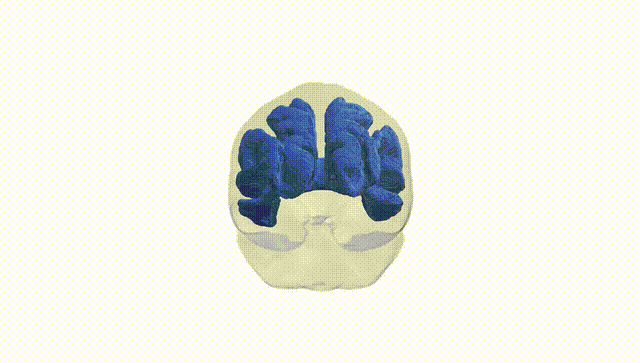
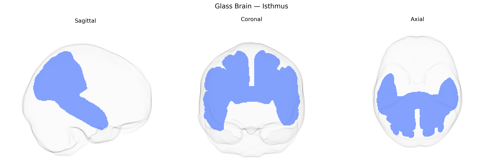

# Isthmus

## Overview

The Isthmus, in the context of the Pandora-TractSeg Atlas, most likely corresponds to the **isthmus of the cingulate gyrus**, a transitional cortical region linking the posterior cingulate cortex with the parahippocampal gyrus and medial temporal lobe structures. This region lies on the medial surface of the cerebral hemisphere, curving around the splenium of the corpus callosum, and participates in limbic and default-mode network circuitry. White matter within and adjacent to the isthmus contains fibers interconnecting posterior cingulate, retrosplenial, and parahippocampal areas, contributing to pathways involved in episodic memory, visuospatial navigation, and internally directed cognition. There is no direct Wikipedia link for the “Isthmus” as a stand-alone white matter tract; a closely related and encompassing cortical region is the [Cingulate gyrus](https://en.wikipedia.org/wiki/Cingulate_gyrus).

Current literature provides very limited tract-specific genetic information for the “Isthmus” white matter tract as defined in the Pandora-TractSeg Atlas, and no robust GWAS has specifically targeted this tract by name. Large diffusion MRI GWAS, such as those from UK Biobank and ENIGMA, have reported genome-wide significant associations between variants in genes involved in axon guidance, myelination, and neurodevelopment (e.g., CNTNAP2, NRG1/NRG3, BDNF, genes in the oligodendrocyte and extracellular matrix pathways) and diffusion measures like fractional anisotropy and mean diffusivity across multiple association, limbic, and callosal tracts, but these findings are typically reported at the level of broader regions (e.g., cingulum bundle, corpus callosum isthmus, posterior cingulate/precuneus connections) rather than for the Pandora-defined Isthmus tract itself. Some genetic studies linking diffusion metrics in cingulum and callosal isthmus regions to psychiatric and neurodevelopmental disorders (e.g., schizophrenia, bipolar disorder, ADHD, autism spectrum disorder, and major depression) suggest that variants influencing white matter microstructure in these pathways may also affect the Isthmus tract, but this remains indirect. As of now, there are no well-established, tract-specific GWAS hits or disorder associations uniquely attributed to the Isthmus tract from the Pandora-TractSeg Atlas, and its genetic architecture is best inferred from broader studies of adjacent or overlapping white matter systems.

*Overview generated by GPT-4o (2026).*

---

**Region ID:** 10  
**Hemisphere:** bilateral  
**Atlas:** Pandora-TractSeg 

---

## Isthmus – Black Background (Full Brain)

**Full Quality Version:** <a href="full_black.mp4" download>Download MP4</a>

---

## Isthmus – White Background (Full Brain)

**Full Quality Version:** <a href="full_white.mp4" download>Download MP4</a>

---

## Triplanar View – T1 Background

---

## Triplanar View – Ghost Brain


