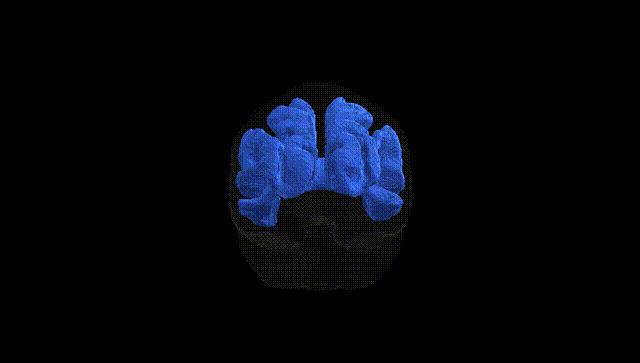
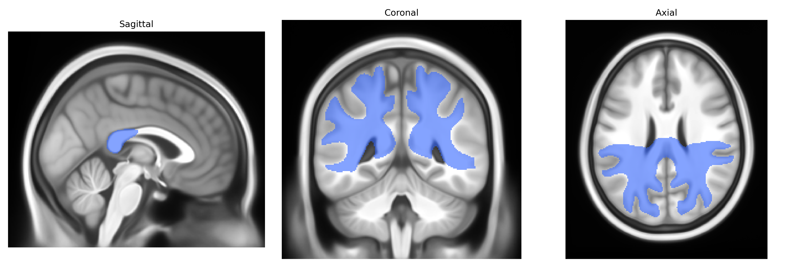

# Isthmus

## Overview

The bilateral isthmus in the Pandora-TractSeg atlas likely corresponds to the isthmus of the cingulate gyrus, a narrow cortical bridge connecting the posterior cingulate cortex to the parahippocampal gyrus within the limbic lobe. This region lies on the medial surface of the cerebral hemisphere, curving around the splenium of the corpus callosum, and is involved in integrating information related to memory, emotion, and visuospatial processing. As part of the broader cingulate–parahippocampal circuitry, it contributes to the default mode network and participates in higher-order cognitive and affective functions by linking medial temporal lobe structures with posterior cortical regions. There is no direct Wikipedia page for the “bilateral isthmus” as defined in the Pandora-TractSeg atlas; a closely related and relevant structure is the cingulate gyrus: https://en.wikipedia.org/wiki/Cingulate_gyrus

*Overview generated by GPT-4o (2026).*

---

**Region ID:** 10  
**Hemisphere:** bilateral  
**Atlas:** Pandora-TractSeg 

---

## Isthmus – Black Background (Full Brain)

**Full Quality Version:** [Download MP4](full_black.mp4)

---

## Isthmus – White Background (Full Brain)

**Full Quality Version:** [Download MP4](full_white.mp4)

---

## Triplanar View – T1 Background

---

## Triplanar View – Ghost Brain


