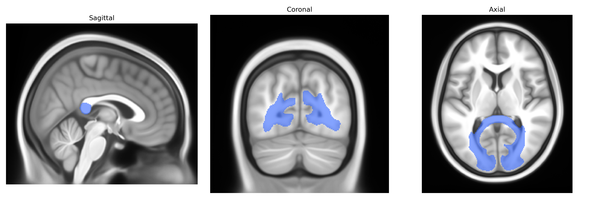

# Splenium

## Overview

The splenium is the posterior, bulbous portion of the corpus callosum composed of densely myelinated commissural fibers that interconnect homologous regions of the occipital, posterior parietal, and posteroinferior temporal cortices across the midline. It plays a critical role in interhemispheric transfer of high-resolution visual information, visuospatial processing, and aspects of reading and language integration that rely on bilateral cortical coordination. The splenium is particularly vulnerable to demyelinating, ischemic, and traumatic lesions, which can result in disturbances such as alexia without agraphia, visual disconnection syndromes, or impairments in visuospatial integration depending on the extent and lateralization of damage. Histologically, it contains a high density of large-diameter, heavily myelinated axons that support rapid conduction velocities necessary for synchronous processing of visual and multimodal sensory information between hemispheres. No direct Wikipedia article exists for the splenium alone; see the related structure [Corpus callosum](https://en.wikipedia.org/wiki/Corpus_callosum).

Current genetic knowledge specific to the Splenium tract as defined in the Pandora-TractSeg Atlas is limited, but broader studies of the corpus callosum—especially its posterior/splenial portion—provide some relevant evidence. Twin and family studies indicate substantial heritability of diffusion MRI measures (e.g., fractional anisotropy [FA], mean diffusivity [MD]) in the splenium of the corpus callosum, and several large-scale neuroimaging GWAS (e.g., UK Biobank–based analyses) have identified loci influencing callosal microstructure, often in or near genes involved in axon guidance, myelination, and oligodendrocyte function (such as genes related to cell-adhesion and cytoskeletal regulation), though findings are typically reported for whole-callosal or regional measures rather than an isolated splenium tract label. Genetic associations linking posterior callosal FA or MD to neuropsychiatric and neurodevelopmental conditions (including schizophrenia, bipolar disorder, ADHD, and autism spectrum disorder) as well as cognitive traits (general cognitive ability, processing speed) have been reported, usually via polygenic score or genetic correlation analyses that implicate callosal microstructure as a partially shared substrate. However, precise tract-level GWAS targeting the Pandora-TractSeg Splenium label, with publicly cataloged SNP-level results, remain sparse, and no single gene or variant is currently established as specifically and robustly associated with this particular tract beyond these broader corpus callosum and white matter microstructure findings.

*Overview generated by GPT-4o (2026).*

---

**Region ID:** 11  
**Hemisphere:** bilateral  
**Atlas:** Pandora-TractSeg 

---

## Splenium – Black Background (Full Brain)

**Full Quality Version:** <a href="full_black.mp4" download>Download MP4</a>

---

## Splenium – White Background (Full Brain)

**Full Quality Version:** <a href="full_white.mp4" download>Download MP4</a>

---

## Triplanar View – T1 Background

---

## Triplanar View – Ghost Brain


