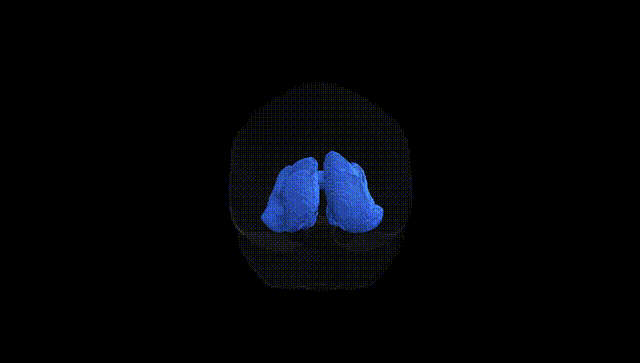
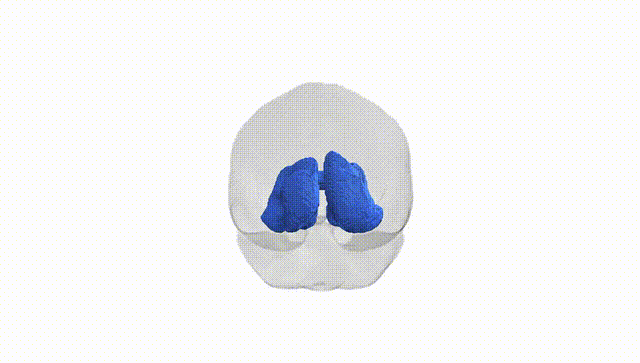
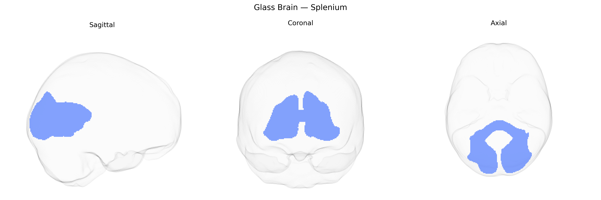

# Splenium

## Overview

The bilateral splenium in the Pandora-TractSeg atlas refers to the posterior portion of the corpus callosum, comprising commissural white matter fibers that interconnect homologous regions of the occipital, posterior parietal, and, to a lesser extent, temporal cortices of both cerebral hemispheres. This tract plays a key role in interhemispheric transfer of visual and visuospatial information, as well as higher-order integrative processing that depends on coordinated activity between posterior associative cortices. Structurally, the splenium is characterized by densely myelinated fibers, supporting rapid signal conduction, and is commonly evaluated in diffusion MRI studies for microstructural integrity in conditions such as multiple sclerosis, traumatic brain injury, and neurodegenerative disorders. There is no direct Wikipedia link for the “bilateral splenium” as defined in the Pandora-TractSeg atlas; the closest related structure is the splenium of the corpus callosum: https://en.wikipedia.org/wiki/Corpus_callosum#Splenium.

*Overview generated by GPT-4o (2026).*

---

**Region ID:** 11  
**Hemisphere:** bilateral  
**Atlas:** Pandora-TractSeg 

---

## Splenium – Black Background (Full Brain)

**Full Quality Version:** [Download MP4](full_black.mp4)

---

## Splenium – White Background (Full Brain)

**Full Quality Version:** [Download MP4](full_white.mp4)

---

## Triplanar View – T1 Background

---

## Triplanar View – Ghost Brain


