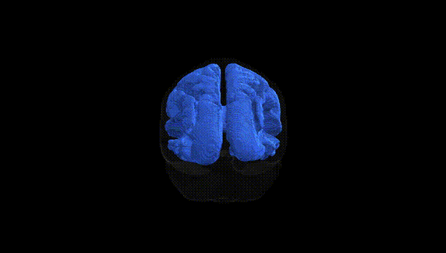
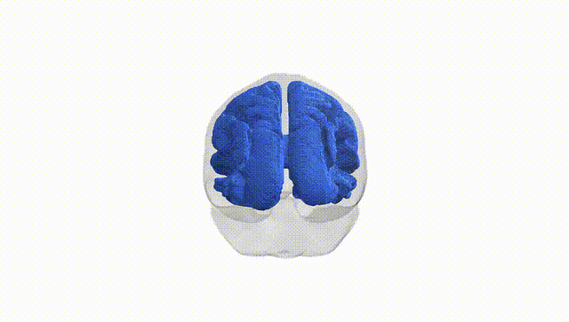
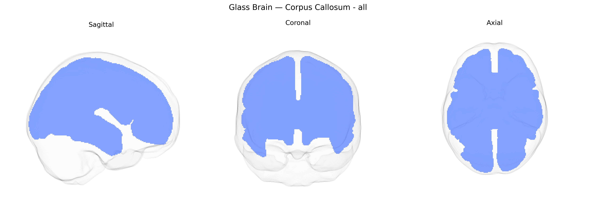

# Corpus Callosum - all

## Overview

The bilateral corpus callosum is a large, C-shaped white matter commissural tract that connects homologous regions of the left and right cerebral hemispheres, enabling interhemispheric integration of sensory, motor, and higher-order cognitive information. Composed primarily of densely myelinated axons originating from cortical pyramidal neurons, it is classically subdivided (anatomically and functionally) into the rostrum, genu, body (truncus), isthmus, and splenium, which preferentially interconnect frontal, premotor, motor, parietal, temporal, and occipital cortices in a topographically organized manner. As a central component of the brain’s commissural system, the corpus callosum supports coordinated bilateral motor control, unified perception across visual and somatosensory fields, and the integration of language, executive, and associative processes, with disruption leading to disconnection syndromes (e.g., split-brain phenomena) and contributing to a range of neurodevelopmental and neurodegenerative conditions.  

Wikipedia URL: https://en.wikipedia.org/wiki/Corpus_callosum

*Overview generated by GPT-4o (2026).*

---

**Region ID:** 12  
**Hemisphere:** bilateral  
**Atlas:** Pandora-TractSeg 

---

## Corpus Callosum - all – Black Background (Full Brain)

**Full Quality Version:** [Download MP4](full_black.mp4)

---

## Corpus Callosum - all – White Background (Full Brain)

**Full Quality Version:** [Download MP4](full_white.mp4)

---

## Triplanar View – T1 Background

---

## Triplanar View – Ghost Brain


