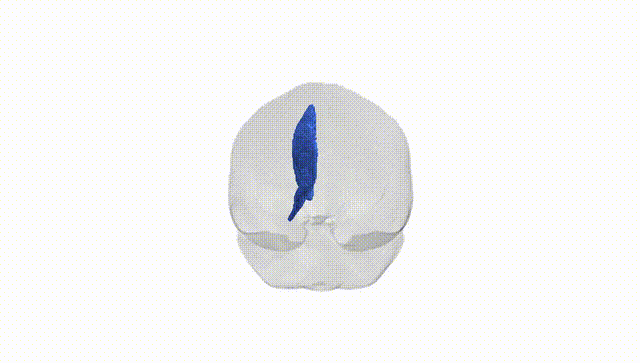
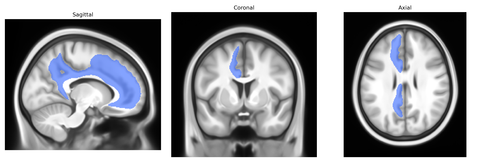
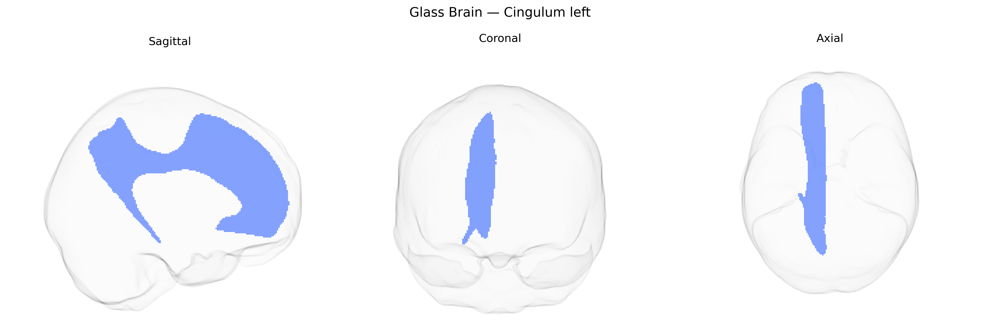

# Cingulum left

## Overview

The Cingulum Left is the left-hemispheric component of the cingulum white matter tract, a major associative fiber bundle that courses within the cingulate gyrus and medial aspects of the cerebral hemisphere. It runs longitudinally above the corpus callosum, interconnecting frontal, parietal, and medial temporal lobe regions, including reciprocal connections between the cingulate cortex, prefrontal areas, and parahippocampal/hippocampal formations. Functionally, the cingulum is implicated in attentional control, executive function, emotional regulation, and memory processes as part of limbic and default mode networks. Structurally, it is a prominent target in diffusion MRI tractography and is commonly examined in studies of neuropsychiatric and neurodegenerative disorders. No direct link exists for the specific left subdivision; see the related tract: [Cingulum (brain)](https://en.wikipedia.org/wiki/Cingulum_(brain)).

Current genetic knowledge specific to the left cingulum bundle (as defined in the Pandora-TractSeg Atlas) is limited, and most evidence comes from large-scale diffusion MRI GWAS that treat cingulum tracts bilaterally or in broader regional groupings rather than this exact atlas-defined segment. Multivariate and tract-specific GWAS of diffusion metrics (e.g., fractional anisotropy, mean diffusivity) repeatedly implicate loci in or near genes involved in axon guidance, myelination, and neurodevelopment—such as DPYSL5, ROBO1/ROBO2, SEMA3 family genes, and oligodendrocyte-related genes like MAG and MBP—showing associations with cingulum microstructure measures, although lateralized (left-only) effects are rarely isolated. Polygenic architecture analyses indicate overlap between genetic influences on cingulum integrity and liability for major psychiatric and cognitive traits, including schizophrenia, major depressive disorder, bipolar disorder, ADHD, autism spectrum disorder, and general cognitive ability, largely via shared variants that affect widespread white matter rather than the left cingulum specifically. Twin and family studies also support moderate heritability of cingulum FA and MD, but do not identify tract-specific variants. Overall, while the cingulum is a heritable tract and shares genetic influences with multiple neuropsychiatric and cognitive phenotypes, precise, replicated variant-level associations and disorder links for the Pandora-TractSeg–defined left cingulum tract alone remain sparse and not yet well differentiated from those of the cingulum as a whole or from global white matter measures.

*Overview generated by GPT-4o (2026).*

---

**Region ID:** 13  
**Hemisphere:** left  
**Atlas:** Pandora-TractSeg 

---

## Cingulum left – Black Background (Full Brain)

**Full Quality Version:** <a href="full_black.mp4" download>Download MP4</a>

---

## Cingulum left – White Background (Full Brain)

**Full Quality Version:** <a href="full_white.mp4" download>Download MP4</a>

---

## Triplanar View – T1 Background

---

## Triplanar View – Ghost Brain


