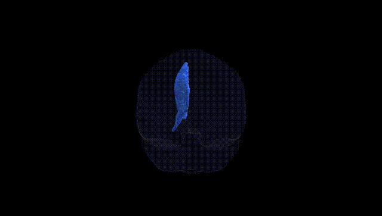

# Cingulum left

## Overview

The left cingulum is a major associative white-matter tract coursing within the cingulate gyrus of the medial cerebral hemisphere, extending from the subcallosal region anteriorly, arching around the corpus callosum, and continuing posteriorly toward the parahippocampal region. It interconnects frontal, parietal, and medial temporal cortical areas, including cingulate, prefrontal, and parahippocampal cortices, thereby forming a key structural component of limbic circuitry implicated in emotion regulation, attention, executive control, and memory. Functionally, the cingulum supports integration of cognitive and affective information and facilitates communication between default mode and limbic networks. In the Pandora-TractSeg atlas, the “left Cingulum” tract label corresponds to this left-hemispheric cingulum bundle, defined in diffusion MRI space by its characteristic trajectory around the corpus callosum and into the medial temporal lobe. There is no direct Wikipedia page specifically for the “left cingulum” tract; a closely related and encompassing structure is described here: https://en.wikipedia.org/wiki/Cingulum_(brain)

*Overview generated by GPT-4o (2026).*

---

**Region ID:** 13  
**Hemisphere:** left  
**Atlas:** Pandora-TractSeg 

---

## Cingulum left – Black Background (Full Brain)

**Full Quality Version:** [Download MP4](full_black.mp4)

---

## Cingulum left – White Background (Full Brain)

**Full Quality Version:** [Download MP4](full_white.mp4)

---

## Cingulum left – Black Background (Hemisphere)

**Full Quality Version:** [Download MP4](hemi_black.mp4)

---

## Cingulum left – White Background (Hemisphere)

**Full Quality Version:** [Download MP4](hemi_white.mp4)

---

## Triplanar View – T1 Background

---

## Triplanar View – Ghost Brain


