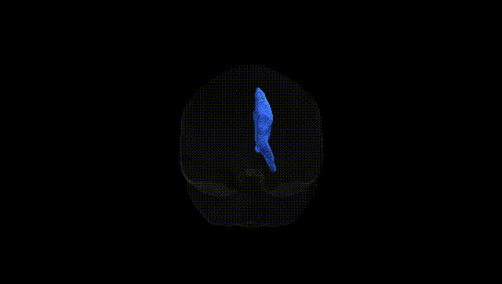
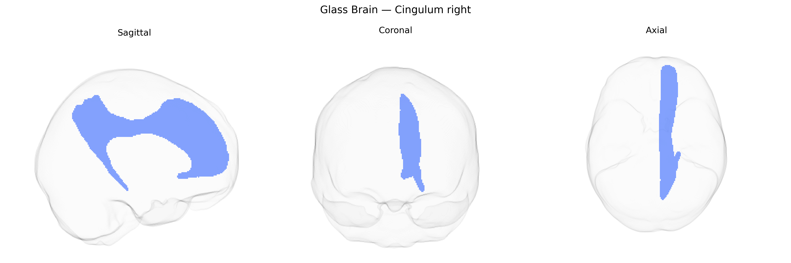

# Cingulum right

## Overview

The Cingulum Right is the right-hemispheric component of the cingulum white matter tract, a major association bundle running within the cingulate gyrus and extending into medial temporal lobe regions. It courses above the corpus callosum, interconnecting frontal, parietal, and medial temporal cortical areas, including the cingulate cortex and parahippocampal regions. This tract supports integration of cognitive, emotional, and mnemonic processes by facilitating communication between limbic and association networks, and is implicated in attention, executive control, emotional regulation, and memory. Microstructural alterations of the right cingulum have been associated with neuropsychiatric and neurodegenerative conditions, including depression, schizophrenia, and Alzheimer’s disease. [Cingulum](https://en.wikipedia.org/wiki/Cingulum_(brain))

Current genetic knowledge specifically tied to the right cingulum bundle as defined in the Pandora-TractSeg Atlas is limited, and most findings relate to the cingulum more broadly or to bilateral/hemispheric-agnostic measures rather than tract- and side-specific effects. Diffusion MRI GWAS of white matter microstructure (e.g., fractional anisotropy, mean diffusivity, neurite density) have identified polygenic influences on cingulum integrity, with SNP-based heritability estimates typically moderate in magnitude and shared across many tracts, implicating widespread neurodevelopmental and myelination pathways rather than cingulum-specific loci. Large consortia such as ENIGMA and UK Biobank–based studies have associated variants near genes involved in axonal guidance, myelin structure, and neuronal development (e.g., regions near CNTN4, NRG1, MAG, and others) with cingulum FA or MD, but these effects rarely distinguish right from left cingulum. Genetically influenced alterations in cingulum microstructure have been reported in relation to risk or endophenotypes for schizophrenia, major depression, bipolar disorder, ADHD, autism spectrum disorder, and Alzheimer’s disease, as well as traits such as cognitive performance, neuroticism, and general psychopathology; however, these links are generally inferred from either bilateral cingulum measures or global white matter indices and have not been robustly localized to the right cingulum segment as delineated in Pandora-TractSeg. Overall, while the cingulum is a known heritable and genetically modulated tract, specific, reproducible GWAS loci and disorder associations uniquely attributable to the right cingulum in the Pandora-TractSeg Atlas remain poorly characterized in the literature as of 2024.

*Overview generated by GPT-4o (2026).*

---

**Region ID:** 14  
**Hemisphere:** right  
**Atlas:** Pandora-TractSeg 

---

## Cingulum right – Black Background (Full Brain)

**Full Quality Version:** <a href="full_black.mp4" download>Download MP4</a>

---

## Cingulum right – White Background (Full Brain)

**Full Quality Version:** <a href="full_white.mp4" download>Download MP4</a>

---

## Triplanar View – T1 Background

---

## Triplanar View – Ghost Brain


