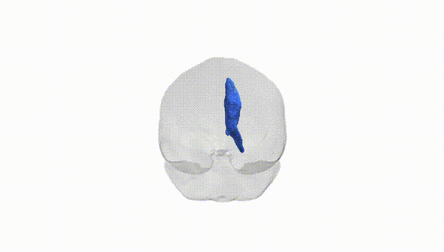
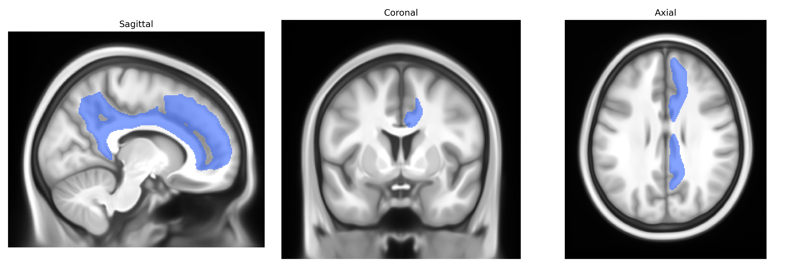

# Cingulum right

## Overview

The right cingulum (right brain) in the Pandora-TractSeg atlas refers to the portion of the cingulum bundle located in the right cerebral hemisphere, a major association white-matter tract running within the cingulate gyrus and parahippocampal region. It arches around the corpus callosum, connecting medial frontal, cingulate, parietal, and medial temporal cortices, thereby supporting integration of cognitive control, attention, emotion regulation, and memory processes, especially episodic and autobiographical memory. Through its extensive links with limbic structures (including the hippocampal formation and parts of the prefrontal cortex), the right cingulum contributes to internal mentation, default mode network activity, and modulation of affective and pain-related responses. There is no direct Wikipedia page for the “right cingulum (Pandora-TractSeg),” but a closely related structure and tract are described here: https://en.wikipedia.org/wiki/Cingulum_(brain).

*Overview generated by GPT-4o (2026).*

---

**Region ID:** 14  
**Hemisphere:** right  
**Atlas:** Pandora-TractSeg 

---

## Cingulum right – Black Background (Full Brain)

**Full Quality Version:** [Download MP4](full_black.mp4)

---

## Cingulum right – White Background (Full Brain)

**Full Quality Version:** [Download MP4](full_white.mp4)

---

## Cingulum right – Black Background (Hemisphere)

**Full Quality Version:** [Download MP4](hemi_black.mp4)

---

## Cingulum right – White Background (Hemisphere)

**Full Quality Version:** [Download MP4](hemi_white.mp4)

---

## Triplanar View – T1 Background

---

## Triplanar View – Ghost Brain


