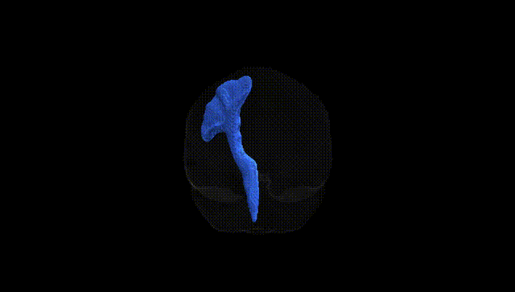
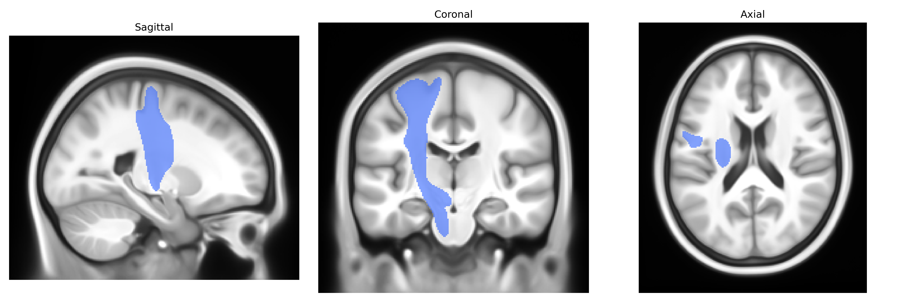
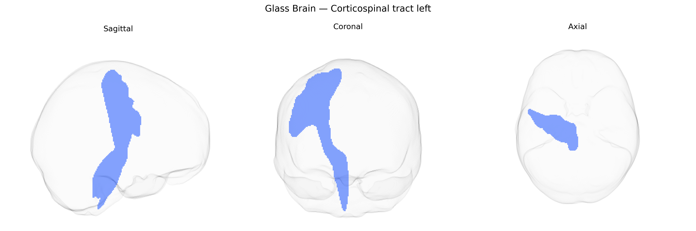

# Corticospinal tract left

## Overview

The left corticospinal tract is a major descending white matter pathway that originates primarily from pyramidal neurons in layer V of the primary motor cortex, premotor cortex, and supplementary motor areas of the left cerebral hemisphere. Axons converge through the corona radiata and internal capsule, descend through the cerebral peduncle in the midbrain, the ventral pons, and the medullary pyramids, where most fibers decussate at the pyramidal decussation to form the lateral corticospinal tract in the contralateral spinal cord, with a smaller proportion remaining uncrossed as the anterior corticospinal tract. Functionally, this tract is critical for the initiation and precise control of voluntary, especially distal, limb movements and fine motor skills, with lesions commonly resulting in contralateral weakness, spasticity, and impaired dexterity. [Corticospinal tract](https://en.wikipedia.org/wiki/Corticospinal_tract)

Current evidence on specific genetic associations for the left corticospinal tract (CST) as defined in the Pandora-TractSeg atlas is limited, and most findings concern the CST more generally or major white matter tracts rather than this atlas-specific segment. Large diffusion MRI GWAS (e.g., UK Biobank–based studies) have identified widespread polygenic influences on white matter microstructure, with variants near genes involved in axon guidance, myelination, and neurodevelopment (such as CNTN4, NTRK3, NCAM1, and MAG) showing associations with fractional anisotropy (FA) or mean diffusivity (MD) in projection fibers that include the CST, but these associations are usually not resolved to the left CST separately. Heritability analyses suggest that FA and MD in the CST are moderately heritable, and twin/family studies report genetic correlations between CST integrity and motor performance, general cognitive function, and risk factors such as blood pressure. Candidate gene and imaging-genetics work has linked common variants in APOE, BDNF, and COMT, among others, to CST or broader motor-tract FA/MD abnormalities in disorders such as multiple sclerosis, cerebral palsy, stroke recovery, and schizophrenia, but these are generally small or heterogeneous studies and not specific to Pandora-TractSeg–defined CST. Overall, the genetic architecture of CST microstructure appears highly polygenic and shared with other white matter pathways, and there are currently no well-established, tract-specific genetic associations uniquely characterized for the left CST in the Pandora-TractSeg atlas.

*Overview generated by GPT-4o (2026).*

---

**Region ID:** 15  
**Hemisphere:** left  
**Atlas:** Pandora-TractSeg 

---

## Corticospinal tract left – Black Background (Full Brain)

**Full Quality Version:** <a href="full_black.mp4" download>Download MP4</a>

---

## Corticospinal tract left – White Background (Full Brain)

**Full Quality Version:** <a href="full_white.mp4" download>Download MP4</a>

---

## Triplanar View – T1 Background

---

## Triplanar View – Ghost Brain


