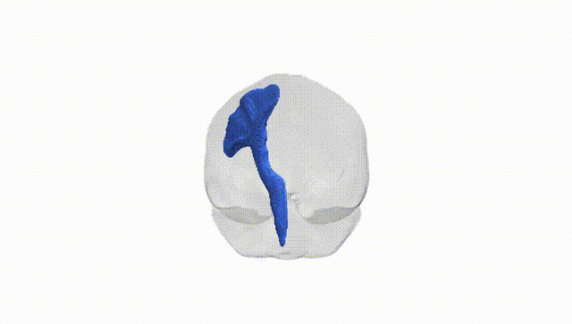

# Corticospinal tract left

## Overview

The left corticospinal tract is a major descending white matter pathway originating primarily from pyramidal neurons in layer V of the primary motor cortex (precentral gyrus), as well as from premotor and supplementary motor areas in the left cerebral hemisphere. Fibers descend through the corona radiata and posterior limb of the internal capsule, traverse the cerebral peduncle in the midbrain, pass through the basilar pons, and form the medullary pyramids, where most axons decussate in the pyramidal decussation to form the lateral corticospinal tract in the contralateral spinal cord, with a minority remaining ipsilateral as the anterior corticospinal tract. Functionally, this tract provides the principal pathway for voluntary, fine, and fractionated movements of distal limb muscles, especially in the contralateral upper extremity, and plays a key role in motor control, motor learning, and modulation of spinal reflexes. There is no direct Wikipedia page specifically for the “left corticospinal tract” from the Pandora-TractSeg Atlas; a closely related structure is described here: https://en.wikipedia.org/wiki/Corticospinal_tract

*Overview generated by GPT-4o (2026).*

---

**Region ID:** 15  
**Hemisphere:** left  
**Atlas:** Pandora-TractSeg 

---

## Corticospinal tract left – Black Background (Full Brain)

**Full Quality Version:** [Download MP4](full_black.mp4)

---

## Corticospinal tract left – White Background (Full Brain)

**Full Quality Version:** [Download MP4](full_white.mp4)

---

## Corticospinal tract left – Black Background (Hemisphere)

**Full Quality Version:** [Download MP4](hemi_black.mp4)

---

## Corticospinal tract left – White Background (Hemisphere)

**Full Quality Version:** [Download MP4](hemi_white.mp4)

---

## Triplanar View – T1 Background

---

## Triplanar View – Ghost Brain


