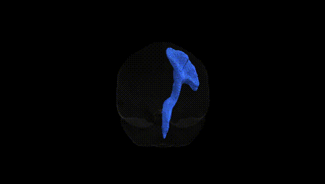
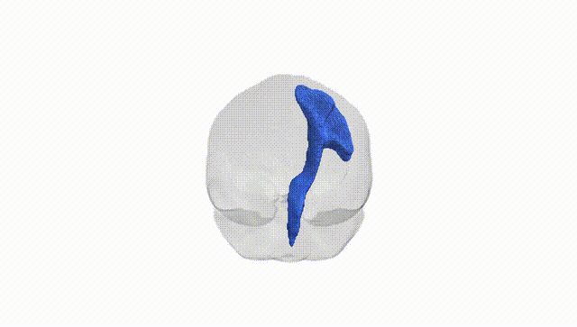
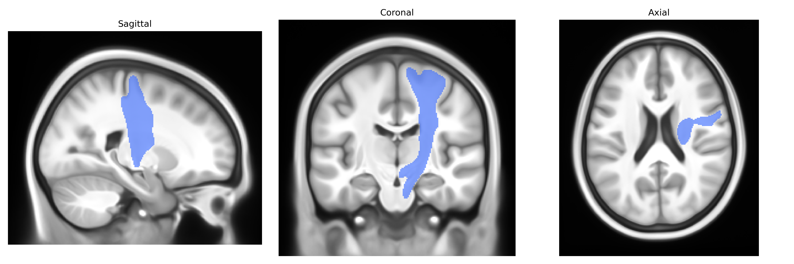
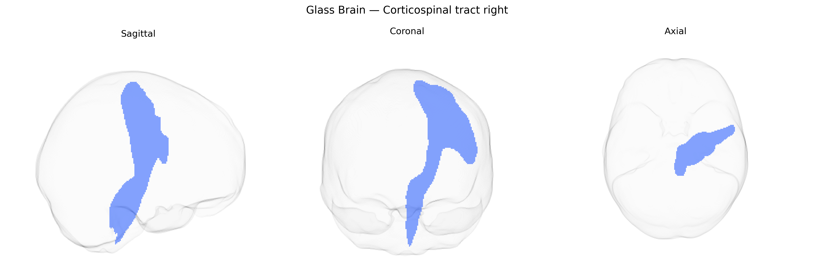

# Corticospinal tract right

## Overview

The right corticospinal tract is a major descending white matter pathway that originates primarily from pyramidal neurons in the primary motor cortex, premotor cortex, and supplementary motor areas of the right cerebral hemisphere. Its axons descend through the corona radiata and posterior limb of the internal capsule, continue through the cerebral peduncle of the midbrain, traverse the ventral pons, and form the medullary pyramids in the medulla oblongata. At the caudal medulla, the majority of fibers decussate in the pyramidal decussation to form the contralateral lateral corticospinal tract, which innervates spinal motor neurons controlling voluntary, fine, and fractionated movements, especially of the distal limbs. The right corticospinal tract thus predominantly influences motor function on the left side of the body and is essential for skilled, goal-directed motor control. There is no direct Wikipedia article for the right corticospinal tract; a closely related entry is [Corticospinal tract](https://en.wikipedia.org/wiki/Corticospinal_tract).

As of the latest published literature, there is very limited tract-specific genetic information for the right corticospinal tract (CST) as defined in the Pandora-TractSeg Atlas, and most genetic findings concern bilateral or global CST or more general white matter properties rather than tract-lateralized effects. Large diffusion MRI GWAS (e.g., UK Biobank–based studies by Elliott et al., Zhao et al., and others) have identified numerous loci associated with diffusion measures (fractional anisotropy, mean diffusivity, and related metrics) in major white matter tracts, including the corticospinal tract, with implicated genes often involved in axon guidance, myelination, and neurodevelopment (e.g., NCAM1, NTRK3, ROBO-related pathways), but these reports generally do not distinguish right from left CST at a fine-grained atlas level such as Pandora-TractSeg. Polygenic influences on CST integrity are indirectly supported by genetic correlations between diffusion metrics in motor tracts and traits such as general cognitive ability, educational attainment, and certain neuropsychiatric conditions, as well as by disease-focused work showing CST microstructural changes in amyotrophic lateral sclerosis and other motor neuron diseases, where risk genes (e.g., C9orf72, SOD1) likely act through broader neurodegenerative mechanisms rather than tract-specific architecture. Overall, while CST-related diffusion phenotypes are clearly heritable and associated with multiple loci, precise, replicated genetic associations specific to the right corticospinal tract in the Pandora-TractSeg framework are currently sparse or not yet reported.

*Overview generated by GPT-4o (2026).*

---

**Region ID:** 16  
**Hemisphere:** right  
**Atlas:** Pandora-TractSeg 

---

## Corticospinal tract right – Black Background (Full Brain)

**Full Quality Version:** <a href="full_black.mp4" download>Download MP4</a>

---

## Corticospinal tract right – White Background (Full Brain)

**Full Quality Version:** <a href="full_white.mp4" download>Download MP4</a>

---

## Triplanar View – T1 Background

---

## Triplanar View – Ghost Brain


