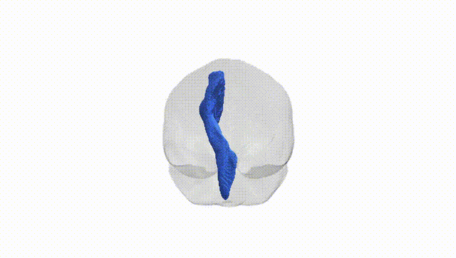
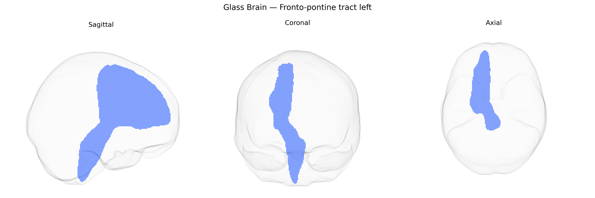

# Fronto-pontine tract left

## Overview

The Fronto-pontine tract left is a white matter pathway that connects the frontal lobe, particularly prefrontal cortical regions, with nuclei in the pons, forming part of the cortico-pontine projection system. Fibers of this tract descend from frontal cortical areas through the anterior limb of the internal capsule and the cerebral peduncles to terminate in pontine nuclei, where they contribute to fronto-cerebellar circuits via subsequent pontocerebellar projections. Functionally, the tract is involved in higher-order motor planning, executive function, and the modulation of cerebellar activity by frontal cortical output, thereby influencing coordinated movement and cognitive-motor integration. There is no direct Wikipedia article for the Fronto-pontine tract; a related structure is the [Cerebral peduncle](https://en.wikipedia.org/wiki/Cerebral_peduncle).

Published genetic association data specifically targeting the left Fronto-pontine tract from the Pandora-TractSeg Atlas appear to be extremely limited, and no large GWAS has yet reported robust, tract-specific loci uniquely attributed to this pathway. Most relevant evidence comes from broader diffusion MRI GWAS that aggregate white matter measures across many tracts, where variants near genes involved in axon guidance, myelination, and neurodevelopment (for example, in or near genes such as CNTN4, NRG1, and some myelin-related loci) show associations with global or regional fractional anisotropy and mean diffusivity but are not anatomically resolved down to the Fronto-pontine tract. Similarly, links between diffusion metrics and disorders such as schizophrenia, major depressive disorder, ADHD, and neurodegenerative conditions have been reported at the level of large-scale fronto–subcortical or brainstem pathways, but attributing these genetic effects specifically to the Fronto-pontine tract is not currently possible. As of now, there are no well-replicated, clearly delineated genetic associations (individual SNPs, genes, or polygenic scores) uniquely and directly tied to variation in diffusion MRI measures of the left Fronto-pontine tract as defined by the Pandora-TractSeg Atlas.

*Overview generated by GPT-4o (2026).*

---

**Region ID:** 17  
**Hemisphere:** left  
**Atlas:** Pandora-TractSeg 

---

## Fronto-pontine tract left – Black Background (Full Brain)

**Full Quality Version:** <a href="full_black.mp4" download>Download MP4</a>

---

## Fronto-pontine tract left – White Background (Full Brain)

**Full Quality Version:** <a href="full_white.mp4" download>Download MP4</a>

---

## Triplanar View – T1 Background

---

## Triplanar View – Ghost Brain


