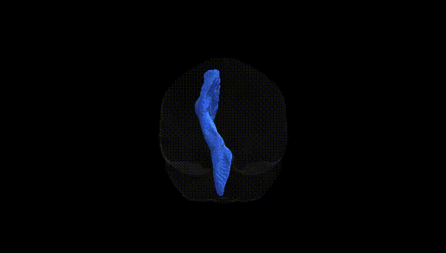
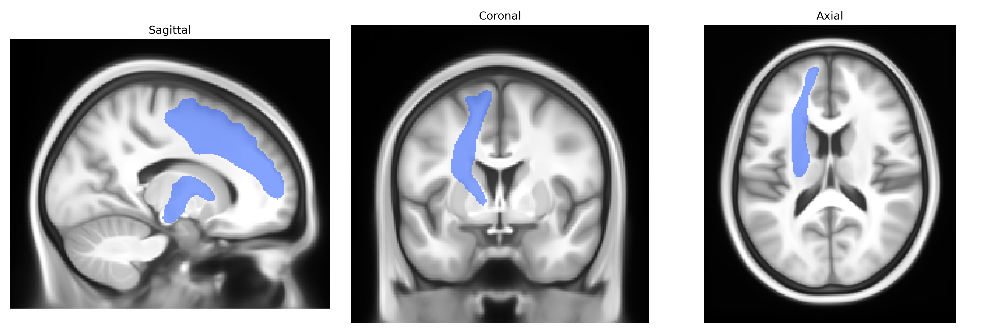

# Fronto-pontine tract left

## Overview

The left fronto-pontine tract is a major association/projection white matter pathway connecting the frontal lobe of the cerebral cortex with pontine nuclei in the brainstem, running predominantly through the anterior limb of the internal capsule and the cerebral peduncle. It carries cortico-pontine fibers originating largely from prefrontal and premotor regions, transmitting information that is subsequently relayed via pontine nuclei to the cerebellum through the middle cerebellar peduncle, thus participating in cortico-cerebello-cortical loops involved in motor planning, coordination, cognitive control, and executive functions. This tract is typically lateralized in diffusion MRI atlases such as the Pandora-TractSeg Atlas, where it is segmented as the left fronto-pontine bundle, and can be affected in various neurological conditions, including stroke, neurodegenerative diseases, and demyelinating disorders, leading to deficits in motor and higher-order cognitive domains. There is no direct Wikipedia link for the “left fronto-pontine tract” as a separate page; a related entry is the “Internal capsule” page, which describes the pathway’s course through this structure: https://en.wikipedia.org/wiki/Internal_capsule

*Overview generated by GPT-4o (2026).*

---

**Region ID:** 17  
**Hemisphere:** left  
**Atlas:** Pandora-TractSeg 

---

## Fronto-pontine tract left – Black Background (Full Brain)

**Full Quality Version:** [Download MP4](full_black.mp4)

---

## Fronto-pontine tract left – White Background (Full Brain)

**Full Quality Version:** [Download MP4](full_white.mp4)

---

## Fronto-pontine tract left – Black Background (Hemisphere)

**Full Quality Version:** [Download MP4](hemi_black.mp4)

---

## Fronto-pontine tract left – White Background (Hemisphere)

**Full Quality Version:** [Download MP4](hemi_white.mp4)

---

## Triplanar View – T1 Background

---

## Triplanar View – Ghost Brain


