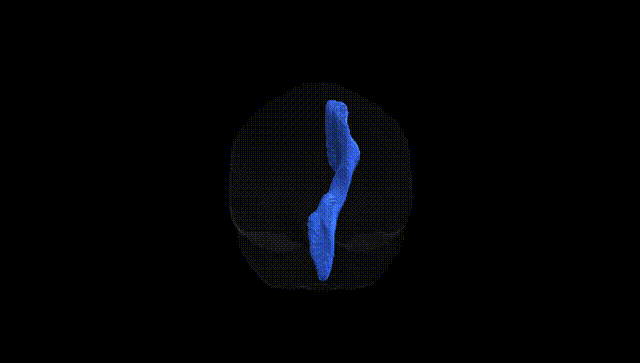
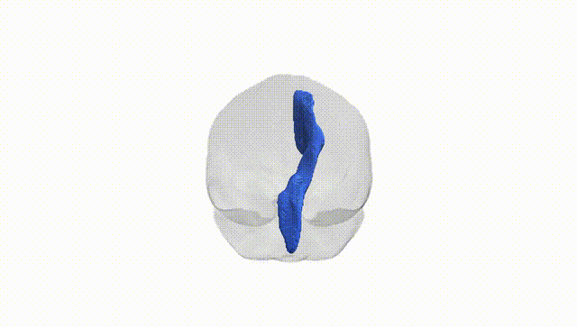
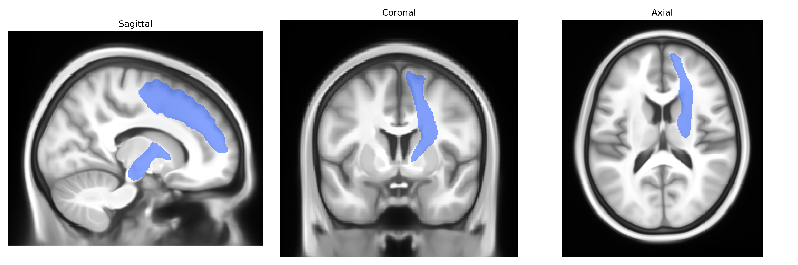
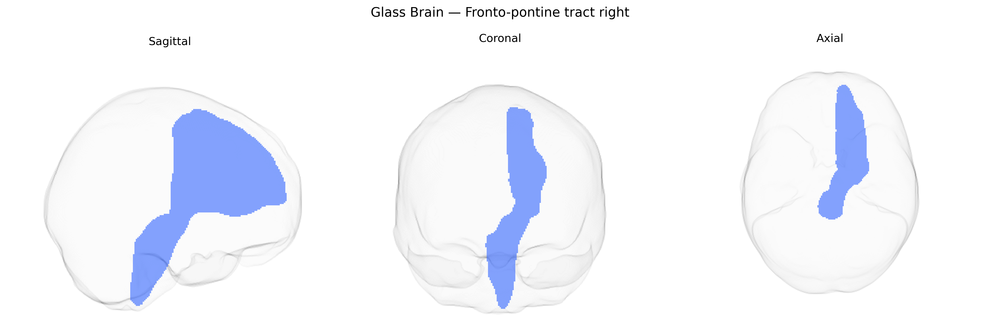

# Fronto-pontine tract right

## Overview

The right fronto-pontine tract is a major projection pathway within the anterior limb of the internal capsule that conveys fibers from the frontal lobe to the ipsilateral pons, forming part of the cortico-pontine system that ultimately projects to the cerebellum via pontine nuclei. Originating primarily in the prefrontal and premotor cortices, these fibers descend through the corona radiata, traverse the genu and anterior limb of the internal capsule, and continue into the cerebral peduncle before terminating in pontine gray matter, where they synapse and relay information to the contralateral cerebellar hemisphere. Functionally, the fronto-pontine tract is involved in higher-order motor planning, cognitive control, and integration of executive functions with motor output, contributing to the modulation of cerebellar circuits that refine behavior and movement. There is no direct Wikipedia article for the fronto-pontine tract; a closely related structure is the [Internal capsule](https://en.wikipedia.org/wiki/Internal_capsule).

As of 2024, there are no well-established, tract-specific genetic associations published for the right Fronto-pontine tract as defined in the Pandora‑TractSeg Atlas, and most large diffusion MRI GWAS do not report findings at the resolution of this individual pathway. Genome-wide studies of white matter microstructure (e.g., fractional anisotropy, mean diffusivity, and related metrics) consistently identify substantial polygenic influences and implicate genes involved in neurodevelopment, axon guidance, myelination, and oligodendrocyte function (such as variants near or in genes like BDNF, MAG, and others), but these associations are generally reported for broader tracts (e.g., anterior thalamic radiation, corticospinal tract, corpus callosum) or for global or regional factors rather than the Fronto-pontine tract specifically. Similarly, genetic links between diffusion measures and neuropsychiatric or neurological disorders (including schizophrenia, major depression, bipolar disorder, ADHD, and neurodegenerative diseases) are typically described at the level of large-scale fronto‑subcortical or brainstem projection systems rather than this exact tract. Consequently, any genetic or GWAS-related inferences regarding the right Fronto-pontine tract from the Pandora‑TractSeg Atlas must currently be extrapolated from more general white matter or fronto‑brainstem findings rather than from direct, tract-specific evidence.

*Overview generated by GPT-4o (2026).*

---

**Region ID:** 18  
**Hemisphere:** right  
**Atlas:** Pandora-TractSeg 

---

## Fronto-pontine tract right – Black Background (Full Brain)

**Full Quality Version:** <a href="full_black.mp4" download>Download MP4</a>

---

## Fronto-pontine tract right – White Background (Full Brain)

**Full Quality Version:** <a href="full_white.mp4" download>Download MP4</a>

---

## Triplanar View – T1 Background

---

## Triplanar View – Ghost Brain


