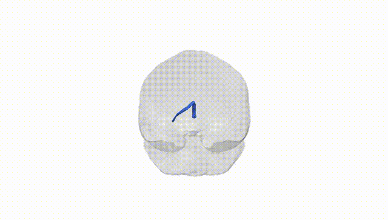
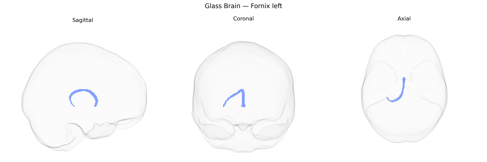

# Fornix left

## Overview

The Fornix left white matter tract is the left-sided component of the fornix, a C‑shaped bundle of myelinated fibers that constitutes a major output pathway of the hippocampal formation and is critical for memory processing and limbic system connectivity. Arising primarily from the hippocampal subiculum and CA1 region, its fibers converge into the fimbria, curve superiorly beneath the corpus callosum, and project anteriorly toward the mammillary bodies and septal nuclei, with collateral connections to other limbic structures. Functionally, the left fornix is particularly implicated in declarative and episodic memory and may show lateralization related to verbal memory functions. Damage or degeneration of this tract, as observed in conditions such as Alzheimer’s disease, epilepsy, or traumatic brain injury, is associated with anterograde amnesia and broader cognitive impairments. There is no dedicated Wikipedia entry for the left fornix specifically; the relevant structure is the bilateral fornix: [Fornix (neuroanatomy)](https://en.wikipedia.org/wiki/Fornix_(neuroanatomy)).

Current genetic knowledge specific to the left fornix white matter tract as defined in the Pandora-TractSeg Atlas is limited, as most imaging-genetics and GWAS studies have examined the fornix as a whole or bilaterally rather than hemisphere-specific tracts. Large diffusion MRI GWAS (e.g., UK Biobank–based studies) have reported that fornix microstructural measures such as fractional anisotropy (FA), mean diffusivity (MD), and related diffusion metrics are heritable and show polygenic influences, with associated loci often enriched in genes involved in axon guidance, myelination, and neurodevelopment (for example, variants near genes like BDNF, NTRK3, and others implicated in white matter integrity more broadly), but these findings are typically not lateralized. Genetic correlations have been reported between fornix diffusion measures and Alzheimer’s disease, cognitive performance, and neuropsychiatric traits (including schizophrenia and major depression), consistent with the fornix’s role in episodic memory and limbic circuitry, yet such studies generally treat the fornix as a single structure. Thus, while there is evidence that fornix microstructure is influenced by common genetic variation and is genetically linked to several brain-related traits and disorders, specific GWAS findings uniquely tied to the left fornix tract in the Pandora-TractSeg Atlas are not well characterized in the current literature.

*Overview generated by GPT-4o (2026).*

---

**Region ID:** 19  
**Hemisphere:** left  
**Atlas:** Pandora-TractSeg 

---

## Fornix left – Black Background (Full Brain)

**Full Quality Version:** <a href="full_black.mp4" download>Download MP4</a>

---

## Fornix left – White Background (Full Brain)

**Full Quality Version:** <a href="full_white.mp4" download>Download MP4</a>

---

## Triplanar View – T1 Background

---

## Triplanar View – Ghost Brain


